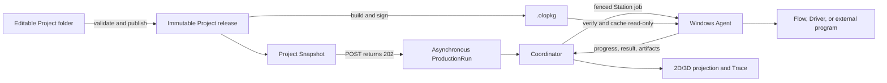

# OpenLineOps Automation IDE, Runner, Coordinator, and Agent

Last updated: 2026-07-11

## Decision summary

OpenLineOps is an IDE and runtime platform for engineering, publishing, and
operating automation production lines. Testing is one possible Operation in a
production route; it is not the product's root abstraction.

The product has four explicit execution surfaces:

1. **OpenLineOps Studio** creates, opens, edits, validates, publishes, runs, and
   monitors Projects.
2. **OpenLineOps Coordinator** owns asynchronous Production Runs, route
   decisions, resource leases, recovery state, and live projections.
3. **OpenLineOps Runner** starts one Production Run from an immutable Project
   Snapshot without opening Studio, waits for its terminal state, writes one JSON
   result, and exits.
4. **OpenLineOps Agent** is a Station-identified Windows host. It consumes
   durable jobs, verifies signed packages, executes frozen content, checkpoints
   commands, buffers results while offline, and exposes an independent safety
   path.

They share application contracts, not UI state or a mutable global project
object. No production host executes draft state or reconstructs trusted
execution data from UI input.

## Reference boundary

The earlier SmartMatriX product is useful only as prior-art input for the user
experience: a directory represents a project, the start experience is New/Open/
Recent, the explorer uses automation vocabulary, and an operator has explicit
run and safety controls.

OpenLineOps does not accept `.ak`, serialize a CLR object graph as project
source, use one global mutable kernel, infer edit mode by hiding windows, or
write runtime databases and logs back into editable source.

## Product artifacts and execution flow



### Editable Project folder

Studio opens one root `<projectId>.oloproj`. The Project composes independently
movable Application directories. Each Application has one `.oloapp` and owns
its topology, layouts, production routes, Flows, Blockly workspaces, Python
sources, Engineering configuration, provider requirements, programs, and custom
blocks.

An Application directory never persists its host Project id. Copying the
complete directory under another Project's `applications` directory and
importing its `.oloapp` must not require rewriting internal files.

Draft source may be incomplete while a user edits it. Runtime never uses draft
source as a fallback.

### Immutable Project release

The server-side publisher resolves the selected Application and freezes:

- Project, Application, snapshot, and release identity;
- strict Topology and hierarchical Layout resources;
- `ProductModelDefinition`, Operations, route transitions, and terminal paths;
- Process graphs, explicit Python source, Blockly workspaces, canonical Flow IR,
  and source maps;
- Engineering configuration and recipes for referenced Station Systems;
- capability, target, Driver, and provider resolution;
- complete provider package trees and command inventories;
- every copied file's size and SHA-256 plus one release content digest.

Opening a release validates its identity, canonical form, exact file set, safe
paths, sizes, hashes, and content digest. Missing or tampered content fails
before hardware access.

### Signed Station package

The Project release adapter builds one `.olopkg` per Station from the complete,
already-frozen release tree. It publishes packages by content hash and writes a
strict Project/Application/Snapshot/Station deployment catalog. The Coordinator
uses a stable Project/Application/Station-to-Agent mapping and resolves the
requested Snapshot from that catalog at dispatch time, so a new Snapshot does
not require configuration changes or a Coordinator restart.

Every package uses one canonical manifest, exact file inventory, Station-bound
content hash, and an RSA-PSS-SHA256 signature from an RSA key of at least 3072
bits. The Agent accepts public trust keys of at least 3072 bits, verifies the
signature, identity, archive paths, inventory, and every file hash, then installs
the content in a read-only content-addressed cache. Private key material is
forbidden inside Projects, releases, package distribution, catalogs, and package
inventories.

Packaged Studio provisions one local signing identity, public trust file,
distribution directory, and deployment catalog in Electron's user-data
directory, then explicitly passes their paths to its backend. A Production
backend never generates or falls back to a key: it requires
`OpenLineOps:Projects:StationPackages` configuration supplied by deployment.

The one-shot Runner consumes the local immutable Project release; it is not the
package creation or deployment CLI. Studio-facing import/deployment uses the
same publisher, catalog resolver, and Agent installer contracts without adding
a second package format.

## Studio lifecycle

### Start Center

With no Project open, Studio shows a Visual Studio-inspired but independently
designed Start Center:

- searchable recent Projects grouped by recency;
- Create Project;
- Open `.oloproj`;
- Open Project Folder;
- keyboard-safe dialogs and recent-Project activation.

The Activity Bar, Project Explorer, editors, Problems, output, and runtime tools
appear only after a Project session exists.

### Project session

The session has explicit `activeProjectId` and `activeApplicationId`. Application
selection scopes every editor, publication request, runtime query, and Trace
view. Code must never silently choose the first Application.

The IDE owns editor tabs, active selection, one unified dirty-resource set,
Save, Save All, close protection, external-file conflict handling, and
Problems navigation. Saving changes editable source only. Publishing performs
cross-context validation and creates immutable content; Save and Publish are
different commands.

### Edit mode

Edit mode exposes:

- a hierarchical 2D topology/layout editor for Station Systems, child Systems,
  Groups, and Slots;
- a Line Designer for Product Model, Operation nodes, typed route edges,
  bounded rework, and parallel fork/join;
- Blockly and explicit PythonScript editing;
- Engineering configuration, recipes, capabilities, Drivers, and provider
  packages;
- vendor-program import, argument/result mapping, protocol trial, permission
  policy, file/hash preview, and publication validation;
- Trace navigation that never mutates production evidence.

Moving a Station shape moves its complete visual subtree because child geometry
is parent-local. The editable semantic 3D view uses the same topology,
parent-local geometry, published identities, and runtime projection; a 3D drag
therefore persists directly into the shared layout rather than another line
model.

### Run and monitor mode

Run mode is read-only and uses the published layout. It displays all active
Production Units and Carriers, Station queues, current Operation and route edge,
Slot occupancy, Station/device state, result judgement, Incidents, and Trace
artifacts.

Creating a Production Run returns `202 Accepted` with the Run identity. Studio
reconnects by querying active Runs and the persisted line projection; an API or
Studio restart does not turn an accepted Run into a client-side failure.

Formal operator commands are `Pause`, `Continue`, `Stop`, `Hold`, `Release`,
`Rework`, `Scrap`, `SafeStop`, `Reconcile`, `Retry`, and `Abort`. `Rework` and
`Retry` identify an Operation. `Reconcile` identifies the exact interrupted
Operation Run and records observed judgement, typed output, and a durable
evidence reference without dispatching the provider. Emergency Stop is not an
ordinary route command; it travels through the Agent's independent safety
receiver.

## Source shape

```text
project-root/
  <project-id>.oloproj
  applications/
    <application-directory>/
      <application-id>.oloapp
      topology/
        topology-<safe-id>--<hash>.json
      layouts/
        layout-<safe-id>--<hash>.json
      production/
        lines/
          <line-definition-id>/
            line.json
            programs/
              ... Application-owned vendor content ...
      flows/
        process-<safe-id>--<hash>/
          flow.json
          nodes/
            node-<safe-id>--<hash>/
              workspace.<sha256>.blockly.json
              source.<sha256>.py
      configuration/
        workspaces/
        projects/
        recipes/
        station-profiles/
      blocks/
        custom/
          block-<safe-id>--<hash>/
            versions/
              version-000001.json
  releases/
    release-<safe-snapshot-id>/
      release.json
      source/
        applications/
          <application-directory>/
            ... frozen Application source ...
```

Only a Blockly node owns `workspace.*.blockly.json`. Only a PythonScript node
owns `source.*.py`. Blockly never persists generated Python source.

Application-relative path resolution rejects absolute references, traversal,
reparse-point escape, ambiguous casing, and writes outside the Application
root. Source writes are staged and atomically replaced. Content-addressed node
files are written before `flow.json`, which acts as the commit pointer.

There is one strict current schema per resource. Unknown fields, missing fields,
unknown enum values, noncanonical identities, and removed formats fail loading.
There is no compatibility reader, alias, migration path, or automatic backfill.

## Production definition

A `ProductionLineDefinition` contains:

- one `ProductModelDefinition` with model code and identity input key;
- one entry Operation id;
- `OperationDefinition` nodes with display name, `stationSystemId`, Flow id,
  and configuration snapshot id;
- `RouteTransition` edges of kind `Sequence`, `Judgement`, `Condition`,
  `Rework`, `ParallelFork`, or `ParallelJoin`;
- optional external-program adapter resources.

There is no duplicate Station aggregate in Production. An Operation binds
directly to the `StationSystem` identity owned by Topology. Publication rejects
an unreachable Operation, missing terminal path, ambiguous condition, unbounded
rework, invalid fork/join, missing Flow/configuration, or a Flow that controls a
different Station subtree without an explicitly authorized line-controller
capability.

Typed Operation output is written to Production Context. A conditional route
reads an explicitly named key, expected value kind, and canonical value; it does
not read an implicit global variable.

External programs are invoked through an ordinary frozen Flow action and the
External Program Host. A valid vendor response indicating a nonconforming item
is `ExecutionStatus.Completed + ResultJudgement.Failed`, allowing the route to
choose retest, repair, isolation, or scrap. A process crash, invalid protocol,
unknown token, timeout, or device fault is an execution failure with an unknown
judgement and creates an Incident.

## Runtime and material model

Runtime owns the changing production facts:

- `ProductionUnit` and disposition (`InProcess`, `Completed`,
  `Nonconforming`, `Held`, or `Scrapped`);
- `ProductionLot`;
- `Carrier` and its capacity/location;
- parent/child `MaterialGenealogyLink`;
- `MaterialLocation` and transfers;
- `SlotOccupancy` (`Available`, `Reserved`, `Occupied`, `Running`, `Blocked`, or
  `Offline`);
- asynchronous `ProductionRun`, `OperationRun`, typed context, route decisions,
  resource leases, Incidents, and recovery state.

Every Slot reservation and occupied state binds a Production Unit or Carrier.
Manual scans, PLC arrivals, and upstream requests enter the same material
command model.

`ExecutionStatus` is `Pending`, `Running`, `Completed`, `Failed`, `TimedOut`,
`Canceled`, or `Rejected`. `ResultJudgement` is `Passed`, `Failed`, `Aborted`,
`Unknown`, or `NotApplicable`. Product disposition is a separate axis.

The Coordinator acquires Station, Slot, Fixture, and Device leases with fencing
tokens. There is no Project-wide run lock, so different products can execute on
different Stations concurrently. A stale lease holder cannot commit a command
as the current owner.

## Coordinator and Agent delivery

The Coordinator persists a Run before Station work is dispatched. Its
transactional outbox publishes `StationJobRequested`; progress and terminal
messages update durable state and projections. Public messages include
`StationJobAccepted`, `StationJobProgressed`, `StationJobCompleted`,
`MaterialArrived`, and `ResourceLeaseChanged`.

Each Agent has one Station identity and uses SQLite for its command Inbox,
result Outbox, and execution checkpoints. Global idempotency keys prevent a
redelivered job from replaying a hardware command. When disconnected, results
remain durable and are delivered after reconnect.

The External Program Host creates an isolated working directory, keeps frozen
release content read-only, applies an environment-variable allowlist and process
limits, streams bounded output, and terminates the full process tree on timeout,
cancel, or host failure. Standard output, error output, CSV, PDF, image, and
report files become hashed Trace artifacts.

Interrupted non-idempotent hardware work enters `RecoveryRequired` and is never
replayed automatically. An authorized operator selects `Reconcile`, `Retry`,
`Abort`, or `Scrap` after comparing physical and persisted state. Every choice
is an immutable, globally identified Recovery Decision. Exact redelivery is a
no-op; reusing its identity with different evidence is rejected. Normal
`Cancel` is unavailable while reconciliation is required.

## Public HTTP contracts

The primary runtime routes are:

```text
POST /api/production-units
GET  /api/production-units/{productionUnitId}
POST /api/production-units/{productionUnitId}/arrivals
POST /api/production-units/{productionUnitId}/transfers
POST /api/production-units/{productionUnitId}/commands/{command}

POST /api/production-lots
GET  /api/production-lots/{lotId}

POST /api/production-carriers
GET  /api/production-carriers/{carrierId}
POST /api/production-carriers/{carrierId}/arrivals
POST /api/production-carriers/{carrierId}/transfers

POST /api/slot-occupancies
GET  /api/slot-occupancies/{lineId}/{stationSystemId}/{slotId}
POST /api/slot-occupancies/{lineId}/{stationSystemId}/{slotId}/commands/{command}

POST /api/material-genealogy
GET  /api/automation-projects/{projectId}/snapshots/{snapshotId}/production-run-context
POST /api/production-runs
GET  /api/production-runs/{productionRunId}
POST /api/production-runs/{productionRunId}/commands/{command}
GET  /api/operations/active-runs
GET  /api/operations/lines/{lineId}/state
```

Request JSON is strict. Canonical command spelling is case-sensitive.
Slot commands are `Reserve`, `ReleaseReservation`, `Load`, `Start`, `Complete`,
`Unload`, `Block`, `Unblock`, `SetOffline`, and `BringOnline`.

## Runner command

`src/OpenLineOps.Runner` accepts a Project directory or `<projectId>.oloproj`,
selects an explicit or active Project Snapshot, verifies its immutable release,
submits a Production Run, executes/polls until terminal, emits one strict JSON
object, and exits. Other project formats and draft-only Projects are rejected.

```powershell
dotnet run --project src/OpenLineOps.Runner/OpenLineOps.Runner.csproj -- `
  run C:\Projects\LineA --snapshot active `
  --production-unit-id 8a9d9629-598e-4e96-a8e7-5df8d7da44a9 `
  --identity UNIT-001 `
  --actor operator-a
```

`--production-unit-id`, `--identity`, and `--actor` are required. Runner
registers and arrives a missing Unit against the immutable release entry Station;
resource identities come only from the frozen Operation. `--snapshot` defaults to
`active`. `--run-id` defaults to a new GUID; supplying it makes submission
explicitly idempotent.

The JSON result includes Project/release identity; Production Run execution,
judgement, disposition, and control state; each Operation and Runtime Session;
route decisions; typed outputs; resource requirements and fencing tokens;
command, step, and Incident counts; and a structured error when unsuccessful.

Stable exit codes:

- `0`: `ExecutionStatus.Completed` (including a nonconforming product
  judgement), or help displayed;
- `2`: command-line usage error;
- `3`: Project path or manifest could not be opened;
- `4`: requested or active snapshot could not be selected;
- `5`: selected snapshot has no immutable release;
- `6`: release verification or Production Run submission was rejected;
- `7`: Production Run execution failed;
- `8`: execution was canceled;
- `70`: unexpected configuration or internal error.

Runner is one-shot, not a daemon or package/deployment command. Runtime and
Trace state are stored outside editable Project source. Recovery never replays
a non-idempotent hardware command.

## Safety and failure policy

- Draft source, global repositories, mutable provider inventory, and live
  Engineering data are never execution fallbacks.
- Station, Slot, Fixture, and Device leases are fenced; a missing lease blocks
  dispatch.
- A Flow controls only its Operation's Station subtree unless a line-controller
  capability is explicitly declared and authorized.
- Signed-package or release verification failure blocks executable loading.
- Emergency Stop uses a separate Agent receiver from the normal job queue.
- Cancel, timeout, Agent termination, and Coordinator restart must leave no
  external child process running.
- Trace preserves Production Unit, Lot, genealogy, location, occupancy, route,
  Operation, command, judgement, Incident, and Artifact evidence.

The central rule is simple: editable source defines the line, publication
freezes it, the Coordinator manages work in progress, the Agent touches the
Station, and Trace records what actually happened.
