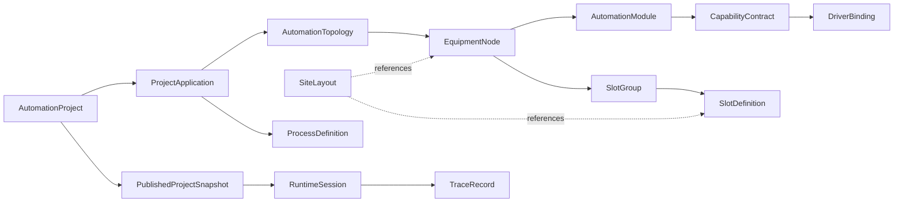

# Composable Automation Model

Last updated: 2026-07-09

## Purpose

OpenLineOps needs a composable building block model for automation projects.
The model must support visual project authoring, physical site layout, device
integration, Blockly process editing, PythonScript extensibility, runtime
execution, and traceability without coupling the domain to a specific UI,
hardware SDK, or vendor standard.

This document defines the target model. It uses industry concepts as anchors
while keeping OpenLineOps as its own product model.

The deeper implementation reference for the composable building block model is
`docs/composable-building-block-architecture.md`.

## Industry Anchors

OpenLineOps should borrow concepts, not copy a standard wholesale:

- ISA-95 / IEC 62264: equipment hierarchy and the manufacturing-control
  boundary. Useful for site, area, line, cell, station, unit, and work-center
  semantics.
- ISA-88 / PackML: unit and machine states. Useful for normalized runtime
  lifecycle, commands, modes, and operator-facing state.
- IEC 61499: application-centric distributed automation using function blocks,
  devices, resources, and mapping. Useful for separating visual logic from
  hardware deployment and modeling reusable blocks.
- PLCopen Motion Control: axis-oriented motion function blocks. Useful for
  expressing move, home, stop, jog, and coordinated motion as capability
  contracts instead of vendor SDK calls.
- AutomationML / IEC 62714: vendor-neutral plant engineering exchange using
  hierarchy, geometry, kinematics, and logic references. Useful for export,
  import, and separating layout data from executable control.
- Asset Administration Shell: digital twin and submodel packaging. Useful for
  future device/module metadata, documents, simulation, geometry, and
  operational data.
- Blockly: visual programming editor with custom blocks and code generation.
  Useful as the default automation authoring surface.
- OpenTAP-style test automation: plugin-based test steps, instruments, DUTs,
  and result listeners. Useful for modular test execution without making test
  steps the whole product model.

The practical interpretation for OpenLineOps is:

- ISA-95 is the anchor for separating equipment, physical asset, material, and
  manufacturing operations information. The OPC UA ISA-95 companion model
  explicitly treats personnel, equipment, physical asset, and material
  information as manufacturing operations resources.
- PackML is the anchor for unit lifecycle language: modes, states, command
  tags, status tags, interlocks, alarms, stop reasons, and operator-facing
  consistency across mixed equipment.
- IEC 61499 is the anchor for composable behavior: function blocks, application
  networks, event/data ports, device/resource mapping, and distributed
  execution without tying the authoring model to a single controller vendor.
- AutomationML is the anchor for future engineering exchange: hierarchy,
  semantics libraries, geometry, kinematics, logic, communication, external
  references, reference designations, and units.
- Asset Administration Shell is the anchor for future digital-twin packaging:
  standardized asset metamodel, APIs, security, and package file format.
- Blockly is the anchor for user extensibility: a custom block needs a block
  definition, code generator, and toolbox reference, and code generation turns
  visual blocks into executable text.

## Production-Line Lessons

Production automation systems usually contain three patterns that must be kept
separate in the domain model:

- Runtime lifecycle scripts exist at multiple levels. Init, main run, pause,
  stop, reset, emergency stop, state-machine, and async scripts are lifecycle
  hooks. They should map to process/runtime policies, not become random files
  hidden inside a generic system object.
- Systems contain both child systems and drivers, but a driver is an adapter,
  not the domain behavior. New flows should target capability contracts such as
  axis movement, light control, barcode scan, fixture clamp, and result upload.
- Stations, fixtures, tooling, DUTs, slot groups, and slots form a material
  handling model. A group has capacity, pick/place policy, calibration
  requirements, fixture binding, and trace rules. A slot is the stable endpoint
  where material is placed, processed, moved, and traced.

These lessons are the reason `System`, `Driver`, `Group`, and `Slot` should not
be copied one-to-one into a flat object tree.

## Core Principle

The product model is not a flat list of application, system, driver, group,
slot, and layout. Those words describe different dimensions.

OpenLineOps should model six orthogonal axes:

1. Project package: what the user opens, saves, versions, publishes, and shares.
2. Automation topology: what exists in the line and how it is structurally
   composed.
3. Capability and driver binding: what operations can be performed and which
   adapter provides them.
4. Material, fixture, and slot model: where DUTs, carriers, nests, fixtures, and
   workpieces can be located.
5. Spatial layout: where topology and material endpoints are drawn in 2D now
   and 3D later.
6. Flow and runtime model: how Blockly/PythonScript turns user intent into
   traceable runtime commands.

## User-Term Mapping

The user-facing terms can stay familiar, but implementation names must be more
precise:

| User-facing term | Domain model | Reason |
| --- | --- | --- |
| Project | `AutomationProject` | The asset opened from the desktop shell, versioned and published. |
| Application | `ProjectApplication` | One automation scenario or deployment profile inside a project. |
| System | `EquipmentNode`, `AutomationModule`, `RuntimeUnit` | "System" can mean topology node, behavior module, or runtime state machine; splitting it prevents a catch-all aggregate. |
| Driver | `DriverPackage`, `DriverBinding`, `CapabilityProvider` | Drivers provide capability implementations; flows should not depend on concrete driver classes. |
| Group | `SlotGroup` or `EquipmentNode(LogicalGroup)` | Material groups and structural groups have different invariants. |
| Slot | `SlotDefinition` plus runtime occupancy records | Draft slot definition and live DUT/workpiece occupancy must be separated. |
| SiteLayout | `SiteLayout` | A spatial projection over topology targets, not the source of truth for topology. |

## Industry Crosswalk For The Composable Model

The short user vocabulary is intentionally product-friendly. The architecture
behind it should align with common industrial automation patterns so that the
model remains useful when projects grow from a single station into lines,
robotic cells, fixture arrays, carrier handling, inspection, MES integration,
and future 3D/digital-twin views.

| Product concept | Industry analogue | OpenLineOps model rule |
| --- | --- | --- |
| `AutomationProject` | Engineering project, deployable package, digital-twin container | The project is the opened workspace and package boundary. It owns identity, applications, draft state, references, and published snapshots, but it does not own live runtime state. |
| `Application` | IEC 61499 application, ISA-95 operations scenario, deployment profile | An application selects topology, layout, process versions, block catalog versions, configuration snapshot, and launch defaults. It is the runnable scenario inside a project. |
| `System` | ISA-88 unit/equipment module, PackML machine/unit, OPC UA machinery object | `System` is a UI/workbench facade. Persist it as an `EquipmentNode` plus `AutomationModule` instances, capability contracts, runtime-unit policy, and provider bindings. |
| `Driver` | Device driver, instrument plugin, OPC UA server, vendor adapter, simulator | A driver is never the process model. Split it into installable package, capability provider, project binding, device instance, and runtime health. |
| `Group` | Fixture nest, work-center group, tray lane, equipment group, carrier area | Use `SlotGroup` for material/workpiece grouping and `EquipmentNode(LogicalGroup)` for structural grouping. Do not use one generic group for both. |
| `Slot` | ISA-95 material location, fixture nest, tray cell, buffer position, DUT endpoint | A slot is a stable design-time endpoint. Runtime occupancy, movement, barcode, measurement, and result facts are separate traceable records. |
| `SiteLayout` | HMI layout, AutomationML geometry view, digital-twin spatial projection | Layout elements reference topology targets by id. Moving or deleting a visual element cannot rename or delete equipment, modules, groups, or slots. |
| `BlocklyBlockDefinition` | IEC 61499 function block, PLCopen motion block, test-step template | A visual block is a versioned authoring contract. It targets capabilities and project targets, then generates governed PythonScript or typed automation actions. |
| `CapabilityContract` | PLCopen-style function block contract, PackML command/status interface, OPC UA method model | Every hardware-touching flow step should request a versioned capability with schema, timeout, cancellation, safety, interlock, and trace metadata. |

This crosswalk leads to one central rule: OpenLineOps can present simple
building blocks in Electron, but the persisted backend model is a typed graph.
The graph separates physical structure, executable behavior, provider routing,
material locations, spatial layout, runtime state, and trace evidence.

## Building Block Assembly Rules

The project explorer can render a friendly tree, but the tree is only a
navigation projection. The canonical composition rules are:

- `AutomationProject` owns `ProjectApplication` and publication history.
- `ProjectApplication` references one active topology, one default layout, one
  or more process definitions, block catalog versions, and launch defaults.
- `AutomationTopology` owns equipment nodes, modules, capabilities, bindings,
  slot groups, slot definitions, ports, and connections.
- `EquipmentNode` provides structural addressability; `AutomationModule`
  provides reusable behavior and capability declarations.
- `CapabilityContract` is the handshake between Blockly/process authoring,
  PythonScript, runtime dispatch, drivers, simulators, and plugins.
- `DriverBinding` resolves a capability requirement to a provider route inside
  a project scope. Bindings are frozen into published snapshots.
- `SlotDefinition` describes where work can happen; `RuntimeSlotOccupancy`
  records what material is there and when it moved.
- `SiteLayoutElement` references topology targets. Layout is never allowed to
  be the only place a system, group, slot, or device exists.
- `ProcessDefinition` and Blockly blocks express automation intent. They do
  not instantiate driver SDK classes or mutate topology drafts.
- `PublishedProjectSnapshot` freezes the runnable graph before Runtime starts.
  Runtime and Traceability reference snapshot ids rather than mutable drafts.

### The Role Of `System`

`System` should remain a first-class user word, but not a monolithic aggregate.
In real automation projects the same visible system may include a station
structure, motion module, light module, IO module, fixture module, simulator,
driver bindings, PackML-like runtime state, layout shape, and trace records.
Putting all of that into one `System` object would couple project editing,
hardware integration, runtime control, visualization, and history.

Use this split instead:

| Workflow | User sees | Persisted model |
| --- | --- | --- |
| Project explorer | System | `EquipmentNode` plus child nodes and attached modules. |
| Module designer | System capability | `AutomationModule` with required/provided `CapabilityContract` ids. |
| Driver setup | System driver | `DriverBinding` scoped to node, module, group, slot, or application. |
| Runtime monitor | System state | `RuntimeUnit` projected from published snapshot and runtime events. |
| Site layout | System shape | `SiteLayoutElement` targeting a node or module id. |
| Trace history | System evidence | `TraceRecord` referencing project, application, snapshot, topology target, command, slot, and provider ids. |

The UI can still let users add a "system". The command should create a coherent
set of typed objects: a node, optional module instances, capability contracts,
recommended slots/groups, default layout elements, and optional provider
binding placeholders.

## Suggested Authoring Experience

The workbench should expose composition as a progressive workflow:

1. Create or open an `AutomationProject`.
2. Add an `Application` for a station, cell, line, product family, or
   simulation profile.
3. Add systems as topology nodes and module instances, not as scripts.
4. Attach drivers or simulators by resolving capability contracts.
5. Create groups and slots for fixtures, DUTs, trays, buffers, carriers, and
   logical work items.
6. Draw the top-down `SiteLayout` by placing references to existing nodes,
   modules, groups, slots, zones, paths, and operator panels.
7. Compose a production line from a DUT model, topology-bound workstations and
   ordered stages that reference published flows.
8. Build each flow with Blockly blocks such as move axis, write output, rotate
   motor, clamp fixture, scan barcode, inspect image, wait, branch, and upload
   result.
9. Let custom blocks declare Blockly shape plus a typed Runtime Action Contract;
   never execute custom Python templates.
10. Publish a snapshot that validates every target, capability, driver binding,
   block version/contract hash, provider package hash, timeout, interlock, and
   trace field.
11. Run from the snapshot and trace back to project/application/topology/layout,
    group, slot, block, script, driver, provider, and operator identities.

## Composable Building Block Layers

OpenLineOps should use four composable block layers.

### Structural Blocks

Structural blocks describe what exists:

- site, area, line, cell, station, unit
- fixture, buffer, transport, device mount, external system
- module instance, port, connection
- slot group and slot definition

They are edited in the project/topology designer and persisted as topology
drafts.

### Capability Blocks

Capability blocks describe what can be done:

- command contract
- input and output schema
- timeout and cancellation policy
- safety class
- required interlocks
- trace fields
- compatible provider kinds

They are consumed by Blockly blocks, process nodes, simulators, drivers, and
runtime dispatch. This is the anti-corruption layer between user-authored
automation intent and hardware SDK details.

### Flow Blocks

Flow blocks describe what should happen:

- move axis X to a position
- turn on a light
- rotate a motor
- clamp a fixture
- scan a barcode
- capture and inspect an image
- pick from a tooling slot and place into a process slot
- upload a result to an external system

Flow blocks are Blockly-first and compile directly to typed Flow IR actions.
Explicit PythonScript nodes remain available for advanced dynamic logic, but a
Blockly block never generates Python or directly instantiates hardware adapters.

### Layout Blocks

Layout blocks describe where things appear:

- node shape
- module shape
- slot shape
- group region
- connection path
- safety area
- operator panel
- label

They reference structural targets by stable ids. Moving a layout element changes
the drawing, not the identity of the equipment, fixture, or slot.

## Block Extension Contract

Users and plugins can add custom Blockly blocks, but each block must be
declared as a versioned contract:

| Field | Purpose |
| --- | --- |
| `blockType` | Stable Blockly type identifier. |
| `version` | Exact immutable definition version. |
| `category` | Toolbox category. |
| `blockDefinition` | Blockly JSON or JavaScript definition. |
| `runtimeActionContract` | Canonical typed emit contract and SHA-256. |
| `inputContract` | Typed inputs accepted by the block. |
| `outputContract` | Typed outputs produced by the block. |
| `requiredCapabilityId` | Capability that must resolve before publish. |
| `targetSelector` | Whether the block targets a node, module, slot group, slot, device, or external endpoint. |
| `safetyClass` | Runtime review and interlock requirements. |
| `traceFields` | Fields that must appear in command trace records. |

Publishing validates custom block versions and contract hashes, capability
bindings, target references, provider package hashes, and safety policies together.

## Conceptual Model



## Project Package Axis

### AutomationProject

The user-facing root asset. It is the thing opened from the desktop shell and
eventually stored as a project folder or package.

Responsibilities:

- project identity and manifest
- project-local settings
- application list
- library references
- active draft version
- publication history
- local package metadata
- compatibility metadata

It should not execute hardware commands or validate vendor SDK settings
directly.

### ProjectApplication

A project can contain one or more applications. An application is a coherent
automation scenario: one product family, one station family, one fixture line,
one tester type, or one reusable deployment profile.

Responsibilities:

- application identity and purpose
- linked topology model
- linked process definitions
- selected layout
- production configuration references
- runtime launch defaults

## Automation Topology Axis

### AutomationTopology

The structural model of the automation project. It describes what exists before
the UI draws it and before Runtime executes it.

Responsibilities:

- equipment hierarchy
- node containment
- node typing
- module instances
- ports and connections
- slot groups and slot definitions
- capability requirements
- driver bindings
- validation rules for topology consistency

### EquipmentNode

An addressable node in the project topology. This is the normalized abstraction
for site, area, line, cell, station, unit, fixture, module, buffer, conveyor,
tester, robot cell, vision cell, electrical cabinet, or logical subsystem.

Recommended node type families:

- `Site`
- `Area`
- `Line`
- `Cell`
- `Station`
- `Unit`
- `Module`
- `Fixture`
- `Buffer`
- `Transport`
- `DeviceMount`
- `ExternalSystem`
- `LogicalGroup`

Rules:

- Node ids are stable and never derived from display names.
- A node has exactly one parent except the topology root.
- A node type controls which child types are allowed.
- A node can reference zero or more module instances.
- Runtime state belongs to Runtime, not to the draft topology.

### AutomationModule

A reusable component instance attached to an equipment node. A module expresses
domain behavior more precisely than a generic system.

Examples:

- vision inspection module
- robot handling module
- axis motion module
- IO module
- light control module
- laser measurement module
- barcode scan module
- MES adapter module
- fixture clamp module
- test instrument module

Rules:

- Module templates and module instances are separate.
- A module declares required and provided capabilities.
- A module can expose ports for signals, material movement, data, or commands.
- A module can be replaced if the replacement satisfies the same contracts.

### Port

A typed connection endpoint. Ports avoid hard-coding point-to-point links as
ad hoc strings.

Port types:

- `CommandPort`
- `EventPort`
- `DataPort`
- `MaterialPort`
- `MotionPort`
- `SafetyPort`
- `PowerPort`
- `NetworkPort`

Rules:

- Connections must be type-compatible.
- Safety and motion ports require stricter validation than ordinary data ports.
- Ports can be visualized in the layout, but topology owns the connection.

## Capability And Driver Axis

### CapabilityContract

A capability is what a block or process can request. A driver is only one way to
fulfill it.

Examples:

- `motion.axis.move`
- `motion.motor.rotate`
- `io.digital.write`
- `vision.capture`
- `vision.inspect`
- `laser.measure`
- `barcode.scan`
- `fixture.clamp`
- `mes.upload-result`
- `operator.prompt`

Contract fields:

- capability id
- semantic version
- command name
- input schema
- output schema
- side effects
- timeout policy
- cancellation support
- safety classification
- required interlocks
- trace fields

Rules:

- Blockly blocks and process nodes target capabilities, not concrete driver
  classes.
- A capability can be provided by simulator, real device plugin, process plugin,
  or future remote service.
- Runtime rejects a command if the published snapshot does not resolve the
  capability to a concrete route.

### DriverPackage

The installable plugin or built-in package that provides adapters, commands,
schemas, diagnostics, and optional UI extensions.

Responsibilities:

- manifest
- compatibility metadata
- provided capabilities
- command definitions
- health model
- optional Blockly generated block definitions
- optional configuration panels
- sandbox and lifecycle requirements

### DriverBinding

Project-local binding from a capability requirement to a concrete provider.

Binding targets:

- device instance
- plugin command
- simulator route
- external system endpoint
- process command provider

Rules:

- Bindings are draft-editable.
- Published snapshots freeze resolved bindings.
- A process cannot rely on an unbound required capability.
- Driver failure is a Runtime/Devices concern, not a topology mutation.

## Material, Fixture, And Slot Axis

### SlotDefinition

A slot is a stable material endpoint. It is not just a UI placeholder. It is the
addressable place where a DUT, carrier, nest, fixture position, tray position,
or logical work item can be placed, processed, moved, or traced.

Fields:

- slot id
- parent node id
- slot index or logical address
- display name
- material kind
- enabled policy
- placement validation rule
- default process target
- fixture reference
- coordinate reference
- optional calibration requirement

Rules:

- Draft slot definition is separate from runtime slot occupancy.
- A slot can be disabled in configuration, but historical traces keep the slot
  id.
- Slot identity must survive rename and layout movement.
- A slot can only hold one active DUT/workpiece at a time unless its material
  policy explicitly allows batching.

### SlotGroup

A controlled material grouping, not a generic folder.

Examples:

- left/right nest
- four-up fixture
- tray row
- tester bank
- robot pick group
- buffer lane

Fields:

- group id
- parent node id
- group type
- member slot ids
- capacity
- pick/place policy
- fixture binding
- carrier binding
- calibration policy
- audit policy

Rules:

- A group owns ordering and capacity semantics.
- Runtime can target a group, but execution must resolve to concrete slots when
  command routing requires it.
- A group can be visualized as a region in SiteLayout.

### Runtime Slot Occupancy

Runtime and Traceability own live and historical occupancy:

- DUT id
- carrier id
- slot id
- station/node id
- process state
- placement state
- timestamp
- actor
- trace links

This keeps project drafts clean and prevents UI editing from mutating runtime
facts.

## Spatial Layout Axis

### SiteLayout

SiteLayout is a spatial projection over topology and slot definitions. It is not
the source of truth for the automation structure.

Responsibilities:

- canvas metadata
- layers
- 2D elements
- optional 3D extension metadata
- references to topology nodes, slots, groups, connections, and zones
- labels, icons, colors, and visual state hints

Element kinds:

- `NodeShape`
- `ModuleShape`
- `SlotShape`
- `GroupRegion`
- `DeviceShape`
- `ConnectionPath`
- `Zone`
- `SafetyArea`
- `Label`
- `OperatorPanel`

Rules:

- Every topology-bound layout element references an existing topology target.
- Deleting a layout element does not delete the topology target unless the user
  explicitly requests a topology deletion.
- Moving a layout element changes visualization, not equipment identity.
- Coordinates should support unit metadata so future CAD/AutomationML import is
  possible.
- 3D is modeled as an extension on spatial elements, not as a different domain.

## Flow And Runtime Axis

### ProcessDefinition

The executable graph. It remains in the Processes bounded context and references
project targets through stable ids and capability contracts.

Blockly-generated flows should produce automation intent, not direct SDK calls.
The current `automation_plan` approach should evolve toward typed actions:

```json
{
  "action": "motion.axis.move",
  "target": {
    "kind": "slot",
    "slotId": "slot.left-nest.1",
    "capability": "motion.axis.move"
  },
  "parameters": {
    "axis": "x",
    "position": 120.0,
    "unit": "mm"
  },
  "timeoutMs": 5000
}
```

### BlocklyBlockDefinition

Custom blocks are project-extensible building blocks.

Required metadata:

- block type
- version
- category
- Blockly JSON
- canonical Runtime Action Contract and hash
- input contract
- output contract
- required capability contract
- target selector type
- safety class
- target-bound action schema

Rules:

- User blocks are versioned.
- The same block version, contract and fields must produce identical Flow IR.
- Blocks emit automation actions that Runtime can dispatch and trace.
- Manual Python remains possible but should use the same runtime command
  contracts whenever it touches hardware.

### PublishedProjectSnapshot

Runtime handoff artifact.

It freezes:

- project manifest version
- topology graph
- module instances
- slot and slot group definitions
- layout references
- process versions
- Blockly block versions
- generated or manually edited Python source hashes
- capability contracts
- resolved driver bindings
- configuration snapshot references
- trace identity metadata

Rules:

- Runtime launches from snapshots, not from drafts.
- Snapshot ids appear in every runtime session and trace record.
- Snapshot validation must prove all required capabilities resolve before
  runtime start.

## Recommended DDD Boundaries

### Projects

Owns project lifecycle, manifest, application list, and publication history.

Aggregates:

- `AutomationProject`
- `ProjectPackage`
- `PublishedProjectSnapshot`

### Topology

Owns automation topology, module instances, ports, connections, slot
definitions, slot groups, and site layout drafts.

Aggregates:

- `AutomationTopology`
- `SiteLayout`
- `ModuleTemplateCatalog`

### Capabilities

This can start inside Devices/Plugins but should be treated as a clear model.
It owns capability contracts and compatibility checks.

Aggregates or services:

- `CapabilityContract`
- `CapabilityProvider`
- `DriverBindingPolicy`

### Processes

Owns Blockly/process authoring and publication.

Aggregates:

- `ProcessDefinition`
- `BlocklyBlockDefinition`
- `BlockCatalog`

### Runtime

Owns execution, command dispatch, state machines, interlocks, and session
recovery.

Aggregates:

- `RuntimeSession`
- `RuntimeCommand`
- `RuntimeIncident`

### Traceability

Owns facts after execution.

Aggregates:

- `TraceRecord`
- `ArtifactRecord`
- `SlotOccupancyRecord`
- `CommandTrace`

## Validation Rules

Minimum publish-time validation:

- Project has at least one application.
- Application has one valid topology.
- Topology has a root node and no cycles.
- Node child types are allowed by node type policy.
- Module instances reference known module templates.
- Required capabilities have compatible providers.
- Driver bindings resolve to devices, plugin commands, simulator routes, or
  external system endpoints.
- Slot ids are unique within the project.
- Slot groups reference existing slots and do not exceed capacity policies.
- Layout references existing topology targets.
- Process definitions are published and compatible with the target project
  snapshot.
- Blockly block versions used by process nodes are available.
- Blockly contract hashes and static Flow IR source maps match the workspace.
- Explicit PythonScript source hashes match published Python node metadata.
- Safety-classified commands declare timeout, cancellation, authorization, and
  interlock policy.

## Naming Guidance

Use these names in the implementation:

- `AutomationProject` for the user-opened asset.
- `ProjectApplication` for an automation scenario inside a project.
- `AutomationTopology` for the structural model.
- `EquipmentNode` for hierarchy nodes.
- `AutomationModule` for reusable behavior-bearing components.
- `CapabilityContract` for command/function contracts.
- `DriverPackage` for installable capability providers.
- `DriverBinding` for project-local route binding.
- `SlotDefinition` and `SlotGroup` for material endpoints.
- `SiteLayout` for spatial projection.
- `ProcessDefinition` for executable flow graph.
- `ProductionLineDefinition` for DUT, workstation and ordered-stage composition.
- `BlocklyBlockDefinition` for visual authoring blocks.
- `PublishedProjectSnapshot` for immutable runtime handoff.

Avoid using `Group` as a universal folder and avoid using `System` as a catch-all
for every composite object. Those words are still useful in the UI, but the
domain model needs sharper boundaries.

## Implementation Order

1. Add project and topology domain skeletons without persistence.
2. Add equipment node hierarchy and type policies.
3. Add module templates, module instances, ports, and connections.
4. Add capability contracts and driver binding validation.
5. Add slot definitions and slot groups.
6. Add SiteLayout as a projection over topology targets.
7. Add published snapshot generation.
8. Update Blockly generated actions to target slots, groups, nodes, or
   capabilities instead of direct driver names.
9. Update runtime launch to consume the snapshot.
10. Update trace records to include project, topology, slot, group, and layout
    references.

## Product Difference From Test Sequencers

OpenLineOps should not center the user experience on editing a list of
properties that call code modules. The primary interaction should be:

- compose the automation topology
- place it visually
- author the flow with Blockly
- inspect compiled Flow IR and source-block mapping
- add an explicit PythonScript node for advanced cases
- publish a snapshot
- run and trace

This is why blocks must be domain-aware. A block should mean "move this slot's X
axis" or "capture image from this station's vision module", not "call arbitrary
driver method with a string payload".

## Reference Links

- ISA-95 OPC UA common object model:
  <https://reference.opcfoundation.org/specs/OPC-10030>
- PackML OPC UA common object model:
  <https://reference.opcfoundation.org/specs/OPC-30050/4.2>
- OMAC PackML overview:
  <https://www.omac.org/packml>
- IEC 61499 overview from Eclipse 4diac:
  <https://eclipse.dev/4diac/doc/intro/iec61499.html>
- AutomationML specifications:
  <https://www.automationml.org/about-automationml/specifications/>
- Asset Administration Shell specifications:
  <https://industrialdigitaltwin.org/en/content-hub/aasspecifications>
- PLCopen Motion Control overview:
  <https://www.plcopen.org/technical-activities/motion-control/>
- Blockly custom blocks overview:
  <https://docs.blockly.com/guides/create-custom-blocks/overview/>
- OpenTAP developer guide:
  <https://doc.opentap.io/Developer%20Guide/Introduction/>
- NI TestStand getting started material:
  <https://learn.ni.com/courses/getting-started-with-teststand>
