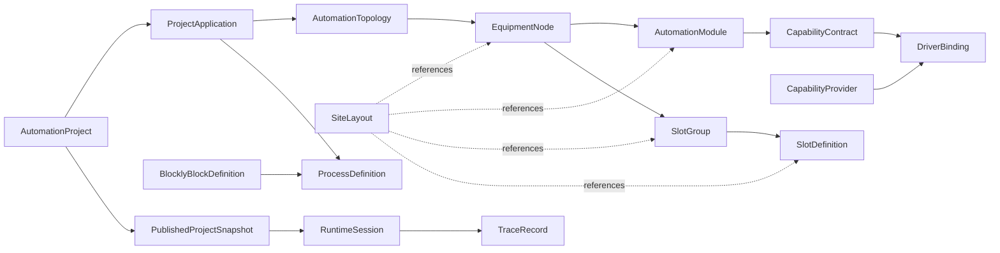
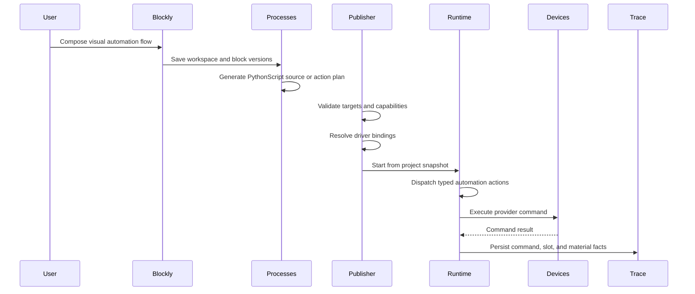

# Composable Building Block Architecture

Last updated: 2026-07-09

## Purpose

OpenLineOps needs a project-first model that lets users create or open an
automation project, compose a production-line structure, draw the site layout,
author flows with Blockly, run PythonScript-backed automation, and trace every
runtime fact back to stable project assets.

The user-facing terms are simple: `AutomationProject`, `Application`, `System`,
`Driver`, `Group`, `Slot`, and `SiteLayout`. The domain model must be sharper.
Those terms describe different dimensions of the same automation project, and
mixing them into one generic tree would make runtime, traceability, plugins,
and future 3D layout difficult to evolve.

This document defines the industry-informed composable model for OpenLineOps.
It is the implementation reference for API, Electron, Blockly blocks,
PythonScript integration, publishing, runtime, and traceability.

## Design Inputs

### Public Industry Anchors

| Anchor | Useful idea | OpenLineOps interpretation |
| --- | --- | --- |
| OPC UA ISA-95 common object model | Manufacturing resources such as equipment, physical assets, material, and personnel are separate information categories. | Separate equipment topology, material slots, runtime actors, and trace facts instead of putting all state in one system object. |
| ISA-88 / batch-control equipment model | Recipes, units, equipment modules, control modules, and procedural elements are separated so that execution can be bound to equipment capabilities. | Keep flow intent, runtime unit state, equipment topology, and provider bindings as separate models. |
| OPC UA for Machinery | Machinery information models are built from reusable basic building blocks with stable namespaces and versioned models. | Model equipment, modules, state, nameplate-like metadata, and provider contracts as reusable typed assets. |
| OPC UA Robotics | Robotics is a vertical integration model, not just a low-level driver call surface. | Treat robot capabilities as domain contracts and map them to device or plugin providers at publish time. |
| OPC UA PackML / OMAC PackML | Machines need consistent modes, states, command tags, status tags, interlocks, alarms, and stop reasons. | Runtime units should expose normalized state and commands regardless of the provider behind them. |
| IEC 61499 / function-block style modeling | Application logic is separate from device and resource mapping; ports/events/data make distributed automation explicit. | Blockly and process graphs express intent; publishing maps that intent to project targets and provider routes. |
| PLCopen Motion Control | Motion behavior is expressed through standardized function blocks and axis-oriented contracts instead of vendor-specific calls. | Motion blocks should request capability contracts such as axis move, home, stop, jog, and coordinated move, then bind to providers. |
| NAMUR MTP | A module package can describe module automation in a vendor-neutral and service-based way for higher-level orchestration. | Driver packages and module templates should describe capabilities, service contracts, HMI/config contributions, and compatibility metadata. |
| AutomationML / IEC 62714 | Plant engineering exchange includes hierarchy, semantics, geometry, kinematics, logic, communication, references, units, and containers. | SiteLayout is a spatial projection with units and references, designed for future CAD/AutomationML import and 3D metadata. |
| Asset Administration Shell | Digital twins need standardized metamodels, APIs, security, and package formats. | Future project packages can expose AAS-like submodels for module metadata, files, simulation, documentation, and operational data. |
| SEMI E30 GEM | Equipment automation benefits from a stable equipment communication and control model, with related standards for processing, carrier handling, and substrate tracking. | Keep equipment command/control, carrier/material movement, and traceability as explicit provider/runtime contracts instead of ad hoc scripts. |
| Blockly | A custom block requires a block definition, a language-specific code generator, and a toolbox reference; blocks generate executable text. | Custom automation blocks are versioned contracts that generate PythonScript code or typed automation actions. |
| OpenTAP | Test automation platforms commonly separate test steps, instruments, DUTs, result listeners, and plugins. | Test execution concepts should integrate through capability-backed process nodes and trace records, not collapse equipment, DUT, and step logic into one object. |

### Public Source Map

These public references are used as design anchors, not as implementation
dependencies:

- NI TestStand overview:
  https://www.ni.com/en/shop/electronic-test-instrumentation/application-software-for-electronic-test-and-instrumentation-category/what-is-teststand
- OpenTAP:
  https://opentap.io/
- Blockly custom blocks:
  https://docs.blockly.com/guides/create-custom-blocks/overview/
- Blockly code generation:
  https://docs.blockly.com/guides/create-custom-blocks/code-generation/overview/
- Eclipse 4diac and IEC 61499:
  https://eclipse.dev/4diac/
- OPC UA ISA-95 common object model:
  https://reference.opcfoundation.org/specs/OPC-10030/4
- OPC UA for Machinery basic building blocks:
  https://reference.opcfoundation.org/specs/OPC-40001-1
- OPC UA PackML common object model:
  https://reference.opcfoundation.org/specs/OPC-30050/4.2
- AutomationML specifications:
  https://www.automationml.org/about-automationml/specifications/
- PLCopen Motion Control:
  https://www.plcopen.org/technical-activities/motion-control
- Asset Administration Shell specifications:
  https://industrialdigitaltwin.org/en/content-hub/aasspecifications

### Industry Research Synthesis

The public sources point to the same architecture direction: keep the user
experience simple, but keep the persisted model typed, versioned, and explicit.
The following decisions are the translation layer from industry practice into
OpenLineOps.

| Industry signal | Design consequence for OpenLineOps |
| --- | --- |
| OPC UA ISA-95 separates role-based equipment, physical assets, material, and personnel models. | Do not put equipment, slot occupancy, operator action, and trace result in one object. `EquipmentNode`, `SlotDefinition`, `RuntimeSlotOccupancy`, operator audit, and trace facts stay separate. |
| ISA-95 equipment levels include work centers, work cells, storage zones, and storage units. | `EquipmentNode` should support site, area, line, cell, station, unit, fixture, buffer, transport, external system, and logical group kinds instead of only "system". |
| OPC UA for Machinery uses reusable basic building blocks, namespace/version metadata, identification/nameplate information, component discovery, monitoring, and machinery item state. | `AutomationModule`, `ModuleTemplate`, `CapabilityContract`, and `DriverPackage` need stable identity, semantic versioning, discoverable metadata, health, and state projections. |
| PackML standardizes modes, states, command tags, status tags, administrative tags, interlocks, alarms, and stop reasons. | Runtime units should expose normalized lifecycle state and command semantics even when providers are PLCs, robot controllers, plugins, simulators, or Python-backed adapters. |
| IEC 61499 and Eclipse 4diac separate application logic from device/resource mapping. | Blockly/process graphs express automation intent. Publishing maps that intent to topology targets, capability contracts, and provider routes. |
| PLCopen Motion Control standardizes motion function blocks and state machines for single-axis and multi-axis control. | Motion-oriented Blockly blocks should target contracts such as `motion.axis.move`, `motion.axis.home`, `motion.axis.stop`, and coordinated motion contracts, not vendor SDK method names. |
| AutomationML/IEC 62714 models object-oriented plant engineering data and separates topology, geometry, kinematics, communication, and logic references. | `SiteLayout` is a spatial projection with coordinate systems, units, layers, and target references. It must not become the source of topology identity. |
| Asset Administration Shell defines metamodel, API, security, and AASX package ideas for asset information exchange. | Project packages should be manifest-driven and extension-friendly, with room for module metadata, documentation, simulation files, CAD/3D files, provider descriptors, and security metadata. |
| Blockly custom blocks require a block definition, code generator, and toolbox reference. | User-defined blocks must be versioned artifacts. They generate deterministic PythonScript or typed automation actions and carry target, capability, timeout, safety, and trace metadata. |
| NI TestStand-style systems run sequences and steps that call code modules. | OpenLineOps should not be only a sequence runner. The primary model is project, topology, visual layout, capability binding, Blockly-authored behavior, runtime session, and traceability. |

This synthesis deliberately avoids making OpenLineOps an implementation of any
single standard. Standards provide vocabulary and proven boundaries; OpenLineOps
uses them to define a practical open-source product model for automation test
line projects.

### Product Domain Lessons

Automation project workbenches need to preserve these domain signals:

- A project is the primary opened asset, but flow execution, UI refresh,
  breakpoints, module output variables, and loop/branch control are mixed in
  the same runtime class. OpenLineOps should split project draft, process
  definition, runtime session, and trace facts.
- Drivers are plugin-created adapters. They have names, current directories,
  descriptors, plugin ownership, and open/close lifecycle. OpenLineOps should
  keep this as `DriverPackage`, `CapabilityProvider`, `DriverBinding`, and
  `DeviceInstance`, not as user-authored flow logic.
- Slot groups represent a set of slots that can be operated together. They can
  have enable policy, fixture binding, test start/finish events, barcode entry,
  and group-level start/cancel behavior. OpenLineOps should model this as
  `SlotGroup`, `SlotDefinition`, runtime occupancy, and trace records.
- Existing visual templates draw a system header and slot group on a 2D canvas.
  OpenLineOps should preserve the idea, but make layout a projection over
  topology targets instead of hard-coding visual controls as the source of
  equipment truth.
- Flow configuration links station groups and process flow choices. OpenLineOps
  should make this a project/application-level association between topology
  targets, process definitions, and publish-time runtime plans.

## Core Decision

The composable model is not:

```text
Project -> Application -> System -> Driver -> Group -> Slot -> Layout
```

That tree is too flat and puts unrelated responsibilities at the same level.
The model is instead a set of coordinated projections over stable identities:



The result is a project package with six independent but linked axes:

1. Workspace asset: what the user opens, saves, publishes, and shares.
2. Topology: what physical and logical automation assets exist.
3. Capabilities and providers: what actions are possible and who implements
   them.
4. Material and slots: where DUTs, carriers, fixtures, trays, nests, and work
   items are placed.
5. Layout: where topology and slot targets appear visually in 2D now and 3D
   later.
6. Flow and runtime: what the line should do and how that intent is executed.

## Industry-Derived Composition Taxonomy

The public standards and industrial automation platforms point to the same
architectural conclusion: a visual automation workbench should feel like
building with blocks, but the backend cannot store "blocks" as one generic
object type. The block model must separate physical structure, control
capability, material handling, spatial representation, executable behavior, and
runtime state.

OpenLineOps should therefore use a typed composition grammar. The grammar is
simple enough for Electron and Blockly, but precise enough for DDD aggregates,
published snapshots, provider compatibility checks, and traceability.

### Composition Dimensions

| Dimension | Industry anchor | User-facing block | Domain object | Main invariant |
| --- | --- | --- | --- | --- |
| Plant structure | ISA-95, AutomationML | Site, line, cell, station, unit | `EquipmentNode` | A node has stable identity, allowed parent/child kinds, and no runtime state in the draft. |
| Machine/module model | ISA-88, OPC UA for Machinery, MTP | System, module, service package | `AutomationModule`, `ModuleTemplate` | A module declares capabilities and ports; replaceability is judged by contracts. |
| Control capability | PLCopen Motion, PackML, robotics models | Axis move, IO write, scan, clamp, inspect | `CapabilityContract` | A flow requests a capability, not a vendor SDK method. |
| Provider binding | Test automation plugins, device drivers, external services | Driver, simulator, plugin, adapter | `CapabilityProvider`, `DriverBinding`, `DeviceInstance` | Publish resolves every required capability to a compatible provider route. |
| Material handling | ISA-95 material model, production traceability | Slot, group, tray, fixture, carrier | `SlotGroup`, `SlotDefinition`, `RuntimeSlotOccupancy` | Slot definition is design-time; occupancy and movement are runtime facts. |
| Spatial projection | AutomationML geometry, future digital twin models | SiteLayout, zone, top-down element, 3D transform | `SiteLayout`, `SiteLayoutElement` | Layout references topology targets and never becomes the source of topology identity. |
| Behavior authoring | IEC 61499, Blockly, process/test sequencers | Visual flow block, custom block, Python block | `ProcessDefinition`, `BlocklyBlockDefinition` | Blocks generate typed automation intent or governed PythonScript calls. |
| Runtime lifecycle | PackML, runtime state machines | Start, run, pause, stop, reset, recover | `RuntimeSession`, `RuntimeUnit`, `RuntimeCommand` | Runtime starts from an immutable snapshot and owns live state. |
| Evidence and history | Test result systems, audit, traceability | Trace, artifact, alarm, operation record | `TraceRecord`, `ArtifactRecord`, `AuditEntry` | Historical facts reference immutable project, topology, process, block, and slot ids. |

### Composition Grammar

The persisted model should accept the following relationships and reject
implicit shortcuts:

```text
AutomationProject
  owns ProjectApplication*
  publishes PublishedProjectSnapshot*

ProjectApplication
  selects AutomationTopology
  selects SiteLayout
  references ProcessDefinition*
  references BlockCatalogVersion*
  references EngineeringConfigurationSnapshot?

AutomationTopology
  contains EquipmentNode*
  contains AutomationModule*
  contains CapabilityContract*
  contains DriverBinding*
  contains SlotGroup*
  contains SlotDefinition*
  contains Port*
  contains Connection*

AutomationModule
  attaches-to EquipmentNode
  requires CapabilityContract*
  provides CapabilityContract*
  exposes Port*
  may-be-instantiated-from ModuleTemplate

DriverBinding
  binds CapabilityContract
  to CapabilityProvider
  scoped-to EquipmentNode | AutomationModule | SlotGroup | SlotDefinition | ProjectApplication

SiteLayoutElement
  references EquipmentNode | AutomationModule | SlotGroup | SlotDefinition | Connection | Zone

BlocklyBlockDefinition
  requires CapabilityContract?
  selects target kind policy
  emits PythonScript source and/or typed automation action

ProcessDefinition
  references BlocklyBlockDefinition*
  references project target ids
  publishes ProcessVersion

PublishedProjectSnapshot
  freezes application, topology, layout, process versions, block versions,
  generated source hashes, capability contracts, driver bindings, and
  configuration snapshot references
```

### Editor Vocabulary Versus Domain Vocabulary

The Electron UI can keep the vocabulary short. The backend must resolve the
same word to the correct bounded-context object.

| UI word | Editor meaning | Domain resolution |
| --- | --- | --- |
| Project | The folder/package currently open in the workbench. | `AutomationProject` aggregate in Projects. |
| Application | A runnable scenario, station family, product family, simulation profile, or deployment profile. | `ProjectApplication` entity that selects topology, layout, process versions, and run defaults. |
| System | A visual grouping that engineers recognize: station system, motion system, light system, vision system, MES system. | Usually `EquipmentNode` plus `AutomationModule`; at runtime it is projected as `RuntimeUnit`. |
| Driver | The installed adapter used to talk to hardware, simulator, external service, or command plugin. | `DriverPackage`, `CapabilityProvider`, `DeviceInstance`, and `DriverBinding`. |
| Group | A set of slots or a logical set of equipment that is operated together. | `SlotGroup` for material/process grouping; `EquipmentNode(LogicalGroup)` for structural grouping. |
| Slot | A stable endpoint where a DUT, carrier, fixture nest, tray position, buffer position, or work item can be placed. | `SlotDefinition` in topology; `RuntimeSlotOccupancy` in runtime and traceability. |
| SiteLayout | The top-down visual model now and optional 3D scene later. | `SiteLayout` aggregate with elements referencing topology targets. |

### Why This Is More Than A Tree

A flat tree is useful for a project explorer, but it should be treated as a
navigation projection only. Several real automation relationships are not
tree-shaped:

- One driver package can provide capabilities for multiple modules.
- One module can require multiple providers when it combines motion, IO, and
  measurement.
- One slot group can span a fixture region in the layout and still resolve to
  individual slots at runtime.
- One process can target a station, a module, a slot group, and a slot in the
  same flow.
- One layout can show a subset of topology targets, or multiple views over the
  same topology.
- One published snapshot must freeze versions from multiple contexts.

Therefore, the canonical storage shape is a typed graph with aggregate-owned
collections. The UI can render explorer trees, canvases, palettes, and Blockly
toolboxes from that graph.

### Standard-Informed Modeling Decisions

- Use ISA-95-style separation to keep equipment, material, personnel/operator
  context, and operations evidence distinct.
- Use ISA-88 and PackML language for runtime units, modes, commands, stop
  reasons, interlocks, alarms, and lifecycle transitions.
- Use IEC 61499-style separation between application logic and deployment
  mapping: Blockly describes intent, publishing maps intent to project targets
  and providers.
- Use PLCopen-like capability contracts for motion so blocks express `home`,
  `move`, `jog`, `stop`, `halt`, and coordinated move semantics instead of
  device-specific method names.
- Use MTP-like packaging ideas for module templates and providers: services,
  configuration, HMI contributions, diagnostics, and compatibility metadata.
- Use AutomationML/AAS-style identifiers and references so future CAD import,
  3D layout, module metadata, file packaging, documentation, and digital-twin
  exchange do not require changing topology identity.
- Use Blockly's block definition plus generator model, but add industrial
  metadata: target selector, capability, safety class, timeout policy,
  cancellation behavior, source hash, and trace fields.

## Industry-Aligned Assembly Model

The composable model should be presented to users as building blocks, but the
backend should persist them as a typed graph with explicit ownership. This is
the key design choice that keeps the product extensible as projects move from
simple stations to multi-cell lines, carrier handling, robotics, inspection,
MES integration, and future 3D layout.

### Model Stack

| Layer | Question answered | Primary owner | Key ids |
| --- | --- | --- | --- |
| Project package | What did the user open, save, publish, and share? | Projects | `projectId`, `applicationId`, `snapshotId` |
| Application profile | Which scenario is being edited or launched? | Projects | `applicationId`, `topologyId`, `layoutId`, `processId` |
| Automation topology | What equipment, modules, ports, connections, slots, and groups exist? | Topology | `topologyId`, `nodeId`, `moduleId`, `portId`, `slotGroupId`, `slotId` |
| Capability contract | What operations can flows request without knowing vendor SDK details? | Topology/Capabilities | `capabilityId`, `capabilityVersion` |
| Provider route | Which simulator, plugin, device, service, or built-in adapter fulfills the contract? | Devices/Plugins | `providerId`, `deviceInstanceId`, `bindingId` |
| Spatial projection | Where is a topology target drawn in 2D or future 3D? | Topology | `layoutId`, `layoutElementId`, `targetRef` |
| Flow authoring | What should happen, visually and textually? | Processes | `processId`, `blockType`, `blockVersion`, `sourceHash` |
| Runtime session | What is running now and which snapshot is it using? | Runtime | `sessionId`, `runtimeUnitId`, `commandId` |
| Trace facts | What happened to commands, material, slots, artifacts, and operators? | Traceability | `traceId`, `occupancyId`, `artifactId`, `materialId` |

### Why `System` Is A Facade

`System` is useful in the UI because automation engineers naturally say
"lighting system", "motion system", "station system", or "test system". It is
too broad for one aggregate. The same visible system can mean:

- a structural `EquipmentNode` when editing hierarchy
- an `AutomationModule` when declaring reusable behavior
- a `RuntimeUnit` when monitoring PackML-like lifecycle
- a `CapabilityProvider` when routing commands
- a `SiteLayoutElement` when drawing the site

Therefore, the product can show `System` in menus and explorers, but the domain
model should resolve it to the specific object required by the workflow. This
avoids a catch-all object that owns configuration, scripts, state, drivers,
layout, and trace data at the same time.

### Assembly Rules

- Structural composition is owned by topology, not by Blockly or Python.
- Behavior composition is owned by process definitions and block definitions,
  not by driver classes.
- Provider composition is owned by driver bindings and capability routing, not
  by visual layout.
- Material composition is owned by slot groups, slot definitions, and runtime
  occupancy records, not by equipment nodes alone.
- Spatial composition is owned by site layout elements that reference topology
  targets; the layout can assist creation but does not replace topology.
- Runtime composition is frozen through `PublishedProjectSnapshot`; mutable
  drafts cannot be used directly by a running session.

### Concrete Building Blocks

| Block | User action | Domain result | Publish-time validation |
| --- | --- | --- | --- |
| Project | Create/open project folder. | `AutomationProject` plus manifest. | Format version, application list, package compatibility. |
| Application | Add a product, station, line, or simulation profile. | `ProjectApplication`. | Topology, layout, processes, run defaults are resolvable. |
| System | Add station/cell/module in explorer or layout. | `EquipmentNode` or `AutomationModule`. | Parent/child kind policy, required capabilities, ports. |
| Driver | Install or bind a provider. | `DriverPackage`, `CapabilityProvider`, `DriverBinding`, `DeviceInstance`. | Capability version compatibility, provider health policy, route scope. |
| Group | Add fixture nest, tester bank, tray row, buffer lane, or robot pick group. | `SlotGroup` or `EquipmentNode(LogicalGroup)`. | Capacity, member slots, pick/place policy, calibration/audit rules. |
| Slot | Add DUT, carrier, fixture, tray, nest, or logical work item endpoint. | `SlotDefinition`. | Unique address, allowed material kind, enabled policy, group capacity. |
| SiteLayout | Draw top-down site and layers. | `SiteLayout` and `SiteLayoutElement`. | Target references exist, coordinates/units/layers are valid. |
| Blockly block | Add built-in, plugin-generated, or user-defined automation block. | `BlocklyBlockDefinition` and process node metadata. | Block version, target selector, generated Python hash, required capability. |

### Example: Axis, Light, Motor

An operator-facing Blockly flow may look simple:

```text
Move X axis to 120 mm
Turn top light on
Rotate motor at 30 rpm for 1500 ms
```

The published runtime plan should resolve it as:

```text
BlocklyBlockDefinition
  -> ProcessDefinition node
  -> CapabilityContract motion.axis.move / io.digital.write / motion.motor.rotate
  -> Topology target node/module/slot
  -> DriverBinding scoped to target
  -> RuntimeCommand
  -> TraceRecord
```

This gives the visual programming surface the flexibility of PythonScript
without letting arbitrary generated code bypass timeout, cancellation,
interlock, provider compatibility, or traceability rules.

## Canonical Composable Model

The seven user terms are intentionally friendly, but they must resolve to a
more precise model before persistence, publishing, runtime dispatch, and
traceability.

OpenLineOps should treat the model as four linked planes:

| Plane | Owns | Main objects |
| --- | --- | --- |
| Workspace plane | Open/save/package/publish semantics. | `AutomationProject`, `ProjectApplication`, `ProjectPackage`, `PublishedProjectSnapshot` |
| Structure plane | What exists in the line and where material can live. | `AutomationTopology`, `EquipmentNode`, `AutomationModule`, `Port`, `Connection`, `SlotGroup`, `SlotDefinition` |
| Provider plane | What operations are possible and which adapter implements them. | `CapabilityContract`, `CapabilityProvider`, `DriverPackage`, `DriverBinding`, `DeviceInstance` |
| Execution plane | What is currently running and what happened. | `ProcessDefinition`, `BlocklyBlockDefinition`, `RuntimeSession`, `RuntimeUnit`, `RuntimeCommand`, `RuntimeSlotOccupancy`, `TraceRecord` |

The product can show a simple tree in Electron, but the persisted model should
stay graph-like:

```text
AutomationProject
  Application
    uses Topology
    uses SiteLayout
    uses ProcessDefinition(s)
    uses BlockCatalog versions
    publishes Snapshot

Topology
  EquipmentNode(s)
    AutomationModule(s)
    SlotGroup(s)
      SlotDefinition(s)
    Port(s) and Connection(s)

CapabilityContract
  implemented by CapabilityProvider
  selected by DriverBinding
  invoked by Blockly/Process/Runtime
```

### User-Term Semantics

- `AutomationProject` is the workspace and package boundary. It is not a
  production-line node.
- `Application` is a scenario or deployment profile inside a project. It
  selects topology, layout, process definitions, block versions, and run
  defaults.
- `System` is a UI facade. In the domain it resolves to an `EquipmentNode`
  when editing structure, an `AutomationModule` when editing behavior, and a
  `RuntimeUnit` when monitoring execution.
- `Driver` is a provider boundary. It declares and implements capabilities,
  but Blockly blocks and process nodes should not depend on driver classes.
- `Group` has two meanings. A material/process grouping is `SlotGroup`; a
  structural grouping is `EquipmentNode(LogicalGroup)`.
- `Slot` is `SlotDefinition` in project drafts and `RuntimeSlotOccupancy` in
  runtime or trace data.
- `SiteLayout` is a visual projection over topology targets. It can create
  targets through UI workflows, but it does not own their identity.

### Composition Rules

- A project can contain multiple applications, but a runtime session starts
  from exactly one published application snapshot.
- An application must resolve one active topology and one default layout before
  it can be published.
- Topology owns identities for nodes, modules, groups, slots, ports, and
  connections.
- Layout elements only reference topology identities; they never replace them.
- Capability contracts are versioned and target-kind aware.
- Driver bindings are scoped by target when the same capability can resolve to
  different providers in different cells, stations, groups, or slots.
- Blockly blocks target capability contracts plus stable project targets.
- Generated PythonScript code calls the runtime command facade or emits a typed
  automation plan; it does not instantiate device adapters directly.
- Runtime commands carry project, application, snapshot, topology target,
  block version, source hash, capability, provider route, and trace ids.

### Industry Calibration

- ISA-95 and the OPC UA ISA-95 model justify keeping equipment, material,
  physical assets, personnel/operator context, and execution facts as separate
  concepts.
- PackML justifies normalized runtime modes, states, command tags, status
  tags, interlocks, alarms, and stop reasons across mixed equipment.
- IEC 61499 and 4diac justify separating application logic from hardware
  mapping: visual flows express behavior first, then publish maps those
  behaviors to devices, resources, providers, and runtime routes.
- OPC UA for Machinery and MTP justify reusable modules with stable
  identifiers, versioned models, provider metadata, services, and health.
- AutomationML justifies representing spatial layout, hierarchy, geometry,
  kinematics, communication, and logic as exchangeable engineering data while
  preserving stable references.
- AAS justifies future package/submodel design for module metadata, documents,
  files, simulation, security, APIs, and digital-twin exchange.
- Blockly justifies custom block registration as a first-class extension
  contract: block definition, generator, toolbox entry, version, input/output
  contract, target selector, and trace metadata.
- OpenTAP and similar test automation platforms justify keeping test steps,
  instruments, DUTs, plugins, results, and listeners modular; OpenLineOps
  should differentiate itself by making visual topology and Blockly-first
  authoring the primary project experience.

## User Terms To Domain Terms

| User term | Domain term | Ownership |
| --- | --- | --- |
| AutomationProject | `AutomationProject` | Projects |
| Application | `ProjectApplication` | Projects |
| System | `EquipmentNode`, `AutomationModule`, `RuntimeUnit` | Topology and Runtime |
| Driver | `DriverPackage`, `CapabilityProvider`, `DriverBinding`, `DeviceInstance` | Plugins, Devices, Topology |
| Group | `SlotGroup` or `EquipmentNode(LogicalGroup)` | Topology |
| Slot | `SlotDefinition`, `RuntimeSlotOccupancy` | Topology, Runtime, Traceability |
| SiteLayout | `SiteLayout`, `SiteLayoutElement` | Topology |
| Blockly block | `BlocklyBlockDefinition` | Processes |
| Python code | `ProcessScriptSource`, generated action plan | Processes and Runtime |

`System` remains a UI word, but it should not be a catch-all domain aggregate.
In implementation, a system can be a topology node, a module instance, or a
runtime unit depending on context.

## DDD Bounded Contexts

### Projects

Owns the user-opened asset and publishing lifecycle.

Aggregates:

- `AutomationProject`
- `PublishedProjectSnapshot`
- future `ProjectPackage`

Responsibilities:

- project manifest and folder/package identity
- application list
- project-local settings
- library references
- publication history
- immutable snapshot assembly

Projects does not execute hardware commands, parse Blockly, or open vendor SDKs.

### Topology

Owns composable automation structure and layout drafts.

Aggregates:

- `AutomationTopology`
- `SiteLayout`
- future `ModuleTemplateCatalog`

Responsibilities:

- equipment hierarchy
- module instances
- capability requirements
- driver bindings
- slot groups and slot definitions
- layout elements and target references
- topology validation

Topology describes what exists. Runtime describes what is happening.

### Capabilities

Starts as a model shared by Topology, Devices, Plugins, and Processes. It can
become its own bounded context when capability marketplace, version negotiation,
or provider certification becomes large enough.

Models:

- `CapabilityContract`
- `CapabilityProvider`
- `CapabilityProviderCompatibility`
- `CapabilityRoute`

Responsibilities:

- versioned command/function schema
- input and output contract
- safety classification
- timeout and cancellation policy
- trace requirements
- provider compatibility

### Processes

Owns visual and textual automation authoring.

Aggregates:

- `ProcessDefinition`
- `BlocklyBlockDefinition`
- `ProcessBlockCatalog`

Responsibilities:

- Blockly workspace data
- user-registered block definitions
- Python code generation
- manual Python source snapshots
- process graph validation
- published process versions

Processes targets stable project ids and capabilities. It does not directly
instantiate device drivers.

### Devices And Plugins

Own provider implementation and lifecycle.

Aggregates and services:

- `DeviceDefinition`
- `DeviceInstance`
- `PluginPackage`
- `PluginManifest`
- `PluginCommand`

Responsibilities:

- device connection state
- vendor adapter lifecycle
- plugin loading and sandbox policy
- command execution
- health and diagnostics
- provider command inventory

### Runtime

Owns execution sessions, command dispatch, state, recovery, and incidents.

Aggregates:

- `RuntimeSession`
- `RuntimeCommand`
- `RuntimeIncident`
- future `RuntimeUnit`

Responsibilities:

- start/pause/resume/stop/cancel
- published snapshot consumption
- command routing
- timeout and cancellation enforcement
- normalized PackML-like states
- runtime event emission
- recovery from persisted session state

### Traceability

Owns historical facts after execution.

Aggregates and records:

- `TraceRecord`
- `CommandTrace`
- `RuntimeSlotOccupancy`
- `ArtifactRecord`
- `AuditEntry`

Responsibilities:

- session facts
- material movement and slot occupancy history
- measurement data
- command results
- files and artifacts
- operator/system audit links

## Aggregate Design

### AutomationProject

Root asset opened by the desktop shell.

Required fields:

- project id
- display name
- description
- project format version
- created and updated timestamps
- applications
- project references
- settings
- publication history

Invariants:

- project id is immutable
- application ids are unique inside the project
- draft edits do not mutate published snapshots
- project manifest format version is explicit

### ProjectApplication

One deployable automation scenario inside a project.

Examples:

- single-station inspection application
- robot plus tester cell application
- fixture-line profile
- process-family profile
- simulation profile

Required fields:

- application id
- display name
- topology id
- default layout id
- process definition references
- run target defaults
- environment profile

Invariants:

- an application references one active topology draft
- process references must be compatible with the application topology
- run defaults never bypass publish-time validation

### AutomationTopology

Structural model of the production line.

Required fields:

- topology id
- display name
- equipment nodes
- module instances
- capability contracts
- driver bindings
- slot groups
- slot definitions
- future ports and connections

Invariants:

- exactly one root node
- node child kind policy is enforced
- nodes, modules, slot groups, and slots have stable ids
- required capabilities must exist before modules reference them
- driver bindings resolve known capabilities
- slot addresses are unique within a parent node
- slot group capacity cannot be exceeded

### EquipmentNode

Addressable topology node.

Recommended kinds:

- `Site`
- `Area`
- `Line`
- `Cell`
- `Station`
- `Unit`
- `Module`
- `Fixture`
- `Buffer`
- `Transport`
- `DeviceMount`
- `ExternalSystem`
- `LogicalGroup`

Rules:

- ids are stable and not derived from display names
- one parent except the root
- child kinds are constrained by parent kind
- a node can host module instances, slot groups, layout elements, and runtime
  state references

### AutomationModule

Reusable behavior-bearing component attached to a topology node.

Examples:

- axis motion module
- motor module
- IO module
- light control module
- robot module
- vision module
- barcode module
- fixture clamp module
- MES adapter module
- tester module

Required fields:

- module id
- node id
- module kind
- display name
- required capability ids
- provided capability ids
- future ports
- template reference

Rules:

- module template and module instance are separate concepts
- replacement is allowed when contracts remain compatible
- module state at runtime is not stored in the draft topology

### CapabilityContract

Versioned operation contract that a block, process node, or module can request.

Examples:

- `motion.axis.move`
- `motion.motor.rotate`
- `io.digital.write`
- `vision.capture`
- `vision.inspect`
- `barcode.scan`
- `fixture.clamp`
- `fixture.release`
- `slot.pick`
- `slot.place`
- `mes.upload-result`
- `operator.prompt`

Required fields:

- capability id
- semantic version
- command name
- target kind policy
- input schema
- output schema
- side effects
- timeout policy
- cancellation support
- safety class
- required interlocks
- trace fields

Rules:

- process and Blockly blocks target capabilities, not concrete SDK classes
- publish validates provider compatibility
- runtime rejects unresolved capability routes
- safety-classified capabilities require explicit timeout, cancellation, and
  interlock declarations

### DriverPackage And CapabilityProvider

Installable or built-in implementation package.

Required fields:

- package id
- display name
- version
- provider kind
- entry point
- compatibility range
- provided capabilities
- command inventory
- diagnostics model
- optional UI contributions
- optional generated Blockly blocks

Provider kinds:

- simulator
- device plugin
- process plugin
- external service
- built-in adapter

Rules:

- providers cannot leak vendor SDK types into domain contracts
- packages are validated before activation
- capability inventory is versioned
- provider health is runtime/operations state

### DriverBinding

Project-local route from a capability requirement to a provider.

Required fields:

- binding id
- capability id
- provider id
- provider kind
- target node/module/slot scope
- command route metadata
- configuration snapshot reference

Rules:

- bindings are draft-editable
- published snapshots freeze resolved bindings
- one capability can have scoped bindings when target scope differs
- binding failure does not mutate topology

### SlotGroup

Controlled material grouping.

Examples:

- fixture nest
- tester bank
- tray row
- tray column
- buffer lane
- robot pick group
- left or right station nest

Required fields:

- group id
- parent node id
- display name
- group kind
- capacity
- member slot ids
- pick/place policy
- fixture binding reference
- carrier binding reference
- calibration policy
- audit policy

Rules:

- group capacity is enforced
- ordering is owned by the group
- runtime can target a group but may resolve to concrete slots
- a group can be rendered as a layout region

### SlotDefinition

Stable material endpoint for a DUT, carrier, fixture position, nest, tray
position, buffer cell, or logical work item.

Required fields:

- slot id
- parent node id
- address
- display name
- material kind
- enabled policy
- placement validation
- default process target
- fixture reference
- coordinate reference
- optional calibration requirement

Rules:

- slot id survives rename and layout movement
- draft slot definition is separate from live occupancy
- historical trace records keep slot ids
- active occupancy is controlled by Runtime and Traceability

### RuntimeSlotOccupancy

Live or historical material state.

Required fields:

- occupancy id
- slot id
- slot group id
- topology node id
- project snapshot id
- material id
- material kind
- state
- start/end timestamps
- actor
- trace references

Rules:

- live occupancy cannot contradict slot material policy
- occupancy records are facts, not layout edits
- runtime movements create traceable transitions

### SiteLayout

Spatial projection over topology targets.

Required fields:

- layout id
- topology id
- display name
- coordinate system
- units
- canvas size
- layers
- elements

Element kinds:

- `NodeShape`
- `ModuleShape`
- `SlotShape`
- `GroupRegion`
- `DeviceShape`
- `ConnectionPath`
- `Zone`
- `SafetyArea`
- `Label`
- `OperatorPanel`

Rules:

- topology-bound elements reference existing targets
- deleting an element does not delete the target
- moving an element changes visualization only
- layout coordinates carry unit metadata
- 3D metadata is an extension on elements, not a separate source of truth

### BlocklyBlockDefinition

Versioned custom visual block contract.

Required fields:

- block type
- semantic version
- category
- block definition JSON or script reference
- Python generator
- toolbox reference
- input contract
- output contract
- target selector policy
- required capability id
- safety class
- trace fields
- generated action schema

Rules:

- block definitions are versioned
- generated Python is deterministic for the same block version and inputs
- blocks generate automation intent or PythonScript code, not direct vendor SDK
  calls
- manual Python can still call the same runtime command API

## Block To Runtime Path

Example: the user drags blocks to move X, turn on a light, and rotate a motor.



Generated action example:

```json
{
  "action": "motion.axis.move",
  "target": {
    "kind": "slot",
    "slotId": "slot.left-nest.1",
    "capabilityId": "motion.axis.move"
  },
  "parameters": {
    "axis": "x",
    "position": 120.0,
    "unit": "mm"
  },
  "timeoutMs": 5000,
  "trace": {
    "reason": "prepare-fixture",
    "operatorVisible": true
  }
}
```

PythonScript should call an OpenLineOps runtime API similar to:

```python
automation.move_axis(target="slot.left-nest.1", axis="x", position=120.0, unit="mm")
automation.write_output(target="module.light.1", channel="top-light", value=True)
automation.rotate_motor(target="module.turntable.1", speed=30.0, unit="rpm", duration_ms=1500)
```

The Python host remains flexible, but hardware-touching operations should pass
through typed runtime commands so timeout, cancellation, interlocks, provider
selection, and trace records are consistent.

## Project Package Shape

Studio opens a folder through its single `.oloproj` entrypoint. Every
Application is a self-contained, copyable directory with its own `.oloapp`:

```text
project-root/
  line-a.oloproj
  applications/
    inspection-cell/
      inspection-cell.oloapp
      topology/
      layouts/
      flows/
        inspect-left-nest/
          flow.json
          artifacts/
      configuration/
      bindings/
      blocks/
      scripts/
  releases/
    release-<snapshot-id>/
      release.json
      source/
        applications/
          inspection-cell/
            ...frozen Application source...
```

Rules:

- `.oloproj` composes Applications but does not embed their editable resources
- no file under an Application root contains the host automation `ProjectId`
- copying the complete Application directory and importing its `.oloapp` does
  not rewrite its resources
- only exact current schema versions are accepted; obsolete formats are rejected
- release files are immutable runtime handoff artifacts
- generated files include hashes and source metadata
- provider packages can be referenced, but executable provider binaries should
  follow plugin package policy

## Publish Validation

Publishing must validate the complete project, not only individual files.

Minimum checks:

- project has at least one application
- application references a topology and layout
- topology has one root node
- topology graph has no cycles
- child node policy is valid
- module instances reference known nodes
- module capabilities exist
- required capabilities have compatible providers
- driver bindings resolve to known devices, plugins, simulators, process
  providers, or external endpoints
- slot ids are unique
- slot addresses are unique under the parent node
- slot group capacity is not exceeded
- slot group members exist
- layout elements reference existing targets
- process definitions are published or publishable
- Blockly block definitions and versions are present
- generated Python hashes match process metadata
- manual Python passes syntax and policy validation
- safety-classified actions declare timeout, cancellation, authorization, and
  interlock policy
- all runtime launch defaults point to immutable versions

## Integration Events

Domain events stay inside aggregates. Integration events cross bounded-context
boundaries after persistence.

Recommended events:

- `AutomationProjectCreated`
- `ProjectApplicationAdded`
- `AutomationTopologyChanged`
- `CapabilityContractDeclared`
- `DriverBindingResolved`
- `SlotGroupConfigured`
- `SlotDefinitionConfigured`
- `SiteLayoutChanged`
- `BlocklyBlockDefinitionRegistered`
- `ProcessDefinitionPublished`
- `ProjectSnapshotPublished`
- `RuntimeSessionStartedFromSnapshot`
- `RuntimeCommandCompleted`
- `SlotOccupancyChanged`

Rules:

- draft-change events can update UI projections and indexes
- runtime starts from `ProjectSnapshotPublished`, not draft topology
- trace records subscribe to runtime facts, not project drafts
- integration event DTOs stay free of domain entities and vendor SDK types

## API Surface

Initial composition API:

```text
POST   /api/automation-projects
GET    /api/automation-projects
GET    /api/automation-projects/{projectId}
PUT    /api/automation-projects/{projectId}/manifest
POST   /api/automation-projects/{projectId}/applications
PUT    /api/automation-projects/{projectId}/applications/{applicationId}
PUT    /api/automation-projects/{projectId}/topology
POST   /api/automation-projects/{projectId}/topology/nodes
POST   /api/automation-projects/{projectId}/topology/modules
POST   /api/automation-projects/{projectId}/topology/capabilities
POST   /api/automation-projects/{projectId}/topology/driver-bindings
POST   /api/automation-projects/{projectId}/topology/slot-groups
POST   /api/automation-projects/{projectId}/topology/slots
PUT    /api/automation-projects/{projectId}/site-layouts/{layoutId}
POST   /api/automation-projects/{projectId}/publish
GET    /api/automation-projects/{projectId}/snapshots
POST   /api/runtime/sessions/from-project-snapshot
```

Desktop file picking and recent project lists belong to Electron. Project state
validation and publication belong to the backend.

## Electron Workbench

Primary panes:

- Start: new project, open project, recent projects
- Project Explorer: applications, topology, layouts, processes, devices,
  plugins, traces
- Topology Designer: nodes, modules, capabilities, bindings, slots, groups
- Site Layout: top-down canvas, layers, references, zones, labels
- Process Designer: Blockly-first flow editor with Python preview/manual mode
- Block Catalog: built-in, plugin-generated, and user-defined blocks
- Runtime: publish, launch, monitor, pause/resume/stop, incidents
- Trace: session history, serial number lookup, command details, slot occupancy

The Site Layout editor must not become the only source of topology. It is a
projection. Creating a visual object can offer to create a topology target, but
the persisted model remains topology-first.

## Identity Policy

Stable ids are intentional architecture.

Rules:

- domain ids are immutable
- display names are editable labels
- id format must be stable across file package, API, runtime, and trace records
- ids should be generated by project services, not UI display text
- snapshots freeze ids and references
- historical trace records must not be repaired by renaming a target

This is not technical debt. It is required for project packages, published
snapshots, runtime recovery, traceability, and plugin compatibility.

## Current Implementation Fit

The current Projects and Topology foundation already points in the right
direction:

- `AutomationProject` and `ProjectApplication` model the project shell.
- `PublishedProjectSnapshot` starts the immutable runtime handoff concept.
- `AutomationTopology` owns equipment nodes, modules, capabilities, driver
  bindings, slot groups, and slots.
- `SiteLayout` is separate from topology and references topology targets.
- application-service and in-memory persistence slices can support the first
  API layer.

Important gaps:

- project folder/package import/export beyond the first manifest file
- SQLite persistence for project and topology drafts
- ports and typed topology connections
- module templates and provider compatibility negotiation
- capability-scoped binding rules
- runtime launch from project snapshot
- trace records enriched with project/application/topology/layout/slot ids
- Electron project shell and site layout editor
- Blockly target selector connected to topology nodes, groups, slots, and
  capabilities

## Implementation Order

1. Keep Projects as the product shell.
2. Extend the first project folder manifest service into a full package format.
3. Add Topology API for nodes, modules, capabilities, bindings, slot groups,
   slots, and layouts.
4. Add SQLite persistence for project and topology drafts.
5. Add module template and port/connection model.
6. Extend Blockly block definitions with target selector and capability
   metadata.
7. Make generated Python produce typed automation actions.
8. Publish project snapshots with resolved provider routes.
9. Start runtime sessions from project snapshots.
10. Add trace enrichment for project, application, topology, slot, group,
    layout, block version, Python source hash, and provider route.
11. Build Electron new/open/recent project shell.
12. Build the first top-down Site Layout editor.
13. Add import/export adapters for future AutomationML, AASX-like packages, and
    3D metadata.

## Architecture Rules

- User-visible concepts can be friendly; domain concepts must stay precise.
- Layout references topology; topology does not depend on layout rendering.
- Blockly blocks target capabilities and project targets.
- PythonScript remains the flexible execution bridge, but hardware actions go
  through runtime command contracts.
- Drivers are providers, not process authoring primitives.
- Slot definitions are project configuration; slot occupancy is runtime and
  traceability data.
- Published snapshots are immutable.
- Integration event payloads must not expose domain entities or SDK objects.
- Future 3D should extend layout metadata without changing topology identity.

## Source Links

- OPC UA ISA-95 common object model: <https://reference.opcfoundation.org/specs/OPC-10030>
- ISA-88 standard family: <https://www.isa.org/standards-and-publications/isa-standards/isa-88-standards>
- OPC UA for Machinery basic building blocks: <https://reference.opcfoundation.org/specs/OPC-40001-1>
- OPC UA for Robotics vertical integration: <https://reference.opcfoundation.org/specs/OPC-40010-1>
- OPC UA PackML common object model: <https://reference.opcfoundation.org/specs/OPC-30050/4.2>
- IEC 61499 and Eclipse 4diac introduction: <https://eclipse.dev/4diac/doc/intro/iec61499.html>
- PLCopen Motion Control overview: <https://www.plcopen.org/technical-activities/motion-control/>
- NAMUR MTP overview: <https://www.namur.net/en/work-areas-and-project-groups/focus-topics/automation-modular-plants-mtp.html>
- AutomationML specifications: <https://www.automationml.org/about-automationml/specifications/>
- Asset Administration Shell specifications: <https://industrialdigitaltwin.org/en/content-hub/aasspecifications>
- SEMI E30 GEM standard entry: <https://store-us.semi.org/products/e03000-semi-e30-specification-for-the-generic-model-for-communications-and-control-of-manufacturing-equipment-gem>
- Blockly custom blocks overview: <https://docs.blockly.com/guides/create-custom-blocks/overview/>
- Blockly code generation: <https://docs.blockly.com/guides/create-custom-blocks/code-generation/overview/>
- OpenTAP developer guide: <https://doc.opentap.io/Developer%20Guide/Introduction/>
