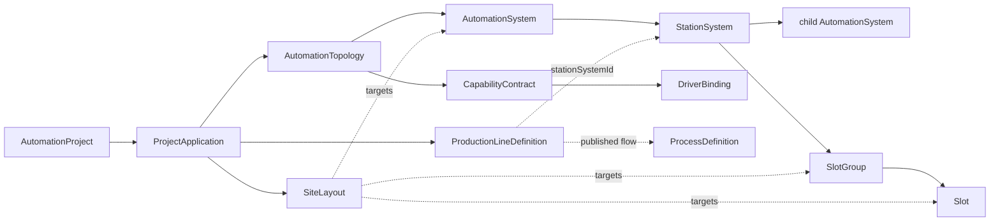
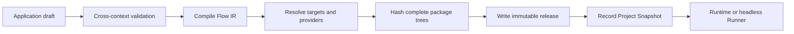

# Composable Building Block Architecture

Last updated: 2026-07-10

## Scope

This document maps the user-facing building blocks to bounded contexts,
persistence, publication, and runtime. The canonical domain semantics are in
`composable-automation-model.md`.

The architecture is a modular monolith with strict context boundaries. The
desktop calls HTTP/SignalR contracts and never opens project resources or
hardware providers directly.

## Canonical vocabulary

| User concept | Canonical owner and type |
|---|---|
| Project | Projects / `AutomationProject` |
| Application | Projects / `ProjectApplication` portable boundary |
| System | Topology / `AutomationSystem` |
| Station | Topology / `StationSystem : AutomationSystem` |
| Capability | Topology / `CapabilityContract` |
| Driver | Topology binding plus frozen provider package |
| Group | Topology / `SlotGroup` |
| Slot | Topology / `SlotDefinition` |
| DUT/work item | Production identity plus Runtime/Trace facts |
| 2D layout | Topology / hierarchical `SiteLayout` |
| Production line | Production / `ProductionLineDefinition` |
| Flow | Processes / `ProcessDefinition` and published Flow IR |
| Live state | Runtime projections keyed by published identities |

No alternate EquipmentNode or AutomationModule identity exists. UI labels,
API contracts, persisted JSON, Flow targets, and release manifests use the
canonical vocabulary.

## Context boundaries

### Projects

Projects owns:

- `.oloproj` and `.oloapp` lifecycle;
- portable Application composition;
- recent-project metadata;
- immutable Project Snapshot publication records;
- release orchestration and content digests;
- opening a verified release for Runtime or Runner.

Projects coordinates contexts during publication but does not edit their
aggregates or execute commands.

### Topology

Topology owns:

- AutomationSystem and StationSystem hierarchy;
- capability contracts and Driver bindings;
- SlotGroups and Slots;
- hierarchical SiteLayouts;
- topology and layout validation;
- Application-scoped filesystem repositories.

Topology contains design-time declarations only. Runtime availability,
occupancy, progress, alarms, and results are projections elsewhere.

### Production

Production owns:

- DUT model and identity input;
- Workstation definitions bound to Station System ids;
- ordered stages bound to published flows;
- external test adapter declarations and result mapping.

Production validates references through read-only ports to Topology and
Processes. It does not launch providers or mutate either aggregate.

### Processes

Processes owns:

- process graphs and publication state;
- Blockly workspace parsing and block catalogs;
- declarative runtime action contracts;
- explicit PythonScript source;
- versioned Flow IR compilation and canonical serialization;
- source maps and graph validation.

Processes only records stable domain target references. It does not resolve
Drivers or execute hardware.

### Engineering

Engineering owns configuration for published Systems: recipes, parameter sets,
calibration/configuration values, and provider selections. A Station profile is
configuration for a Station `systemId`; it is not another Station identity.

### Devices and Plugins

Devices owns device definitions, instances, commands, connection state, and
execution adapters. Plugins owns package discovery during authoring and exact
package invocation at runtime.

Published execution resolves routes only from the Project release lock. Live
inventory and mutable Engineering data are not fallback paths.

### Runtime

Runtime owns sessions, steps, actions, commands, timeouts, retries, incidents,
alarms, and live projections. It accepts an executable process produced from a
verified Project Snapshot.

Runtime cannot discover a process, topology, configuration, or provider from a
global repository when a release resource is absent. Absence is a hard failure.

### Traceability

Traceability records evidence with Project, Application, snapshot, Flow,
Station System, target, Driver package, command, DUT, Group, and Slot identity.

## Aggregate relationships



## Strict current Topology v1 contract

The Application topology document has one supported schema version and these
collections:

```text
systems[]
capabilities[]
driverBindings[]
slotGroups[]
slots[]
```

Each System records `systemId`, optional `parentSystemId`, `kind`, `systemType`,
`displayName`, required/provided capability ids, and strict metadata. Groups
and Slots reference a Station System. Collections reject duplicate ids,
addresses, incompatible parents, missing capabilities, and case drift.

Unknown JSON fields, unknown enum values, missing required collections, and
non-current schema versions fail loading. Repositories do not normalize or
migrate older resource documents.

## Strict hierarchical Layout v1

An element is:

```json
{
  "elementId": "layout.station.functional-test",
  "kind": "SystemShape",
  "target": {
    "kind": "System",
    "targetId": "station.functional-test"
  },
  "parentElementId": null,
  "x": 120,
  "y": 80,
  "width": 520,
  "height": 340,
  "rotationDegrees": 0,
  "zIndex": 10,
  "style": {}
}
```

Nested element coordinates are local to their parent. The Application service
loads the referenced topology and verifies both the layout parent kind and the
target-domain parent relationship before saving.

The editor previews drag motion locally and persists the final geometry. The
server clamps nothing and guesses nothing: invalid or out-of-bounds geometry is
rejected so the client must present the failure and restore the last saved
state.

## Flow target contract

Flow IR supports only:

```text
System
Capability
Driver
SlotGroup
Slot
Dut
```

An action carries target kind/id, capability, command, canonical input,
timeout, retry policy, and source map. A target must resolve exactly once in
the frozen topology/release. `Capability` target id must equal the requested
capability. `Driver` target id must resolve to the frozen binding used by the
capability.

Blockly blocks compile to these actions at publication. PythonScript is one
explicit published action and cannot emit a runtime action plan.

## Publication pipeline



Publisher freezes:

- current Application project file;
- Topology v1 and Layout v1 documents;
- Production line definitions;
- Process graphs, Blockly workspaces, Python source, and canonical Flow IR;
- exact block versions and action contract hashes;
- configuration for referenced Station Systems;
- capability/Driver bindings;
- provider package id, version, tree hash, manifest hash, entry hash,
  runtime identifier, ABI, commands, and file inventory.

Runtime validates the release manifest and every referenced hash before it
creates a session.

## Runtime and monitor projection

Design resources remain immutable during execution. Runtime projections are
keyed by `systemId` and target kind/id:

- Station status summarizes the latest/current session;
- target status summarizes the latest/current action or command;
- Slot occupancy is a material-state projection;
- alarms and trace facts reference the same identities.

The 2D monitor joins these projections to the published layout. Draft Edit mode
may show no runtime overlay; Run mode is read-only and uses the release layout.
SignalR updates change projection state only.

## Storage and portability

All editable context resources live under the owning Application directory and
use Application-relative paths. They do not persist the host Project id. Path
resolution rejects traversal, reparse-point escape, ambiguous casing, absolute
resource references, and writes outside the Application root.

Writes are atomic and idempotent. A copied Application can be imported into a
different Project without rewriting its internal ids or files. Publication
copies required resources into a content-addressed release; Runtime never opens
the editable files.

## Dependency rules

- Domain projects depend only on shared domain abstractions.
- Application projects depend on their Domain and explicit ports.
- Infrastructure implements Application ports.
- API maps HTTP/SignalR contracts and composition only.
- One context never references another context's Infrastructure.
- Cross-context publication checks use Application interfaces.
- Desktop contracts mirror current HTTP JSON only; they contain no aliases for
  removed fields.

## Failure policy

The following conditions fail closed:

- missing or wrong-schema topology/layout/process/line resource;
- unresolved or duplicate System/Group/Slot target;
- a Group outside its Station or a Slot outside its Group;
- invalid nested geometry;
- missing published Flow or configuration;
- incomplete release identity;
- missing/tampered provider artifact or hash mismatch;
- attempt to execute through editable/global/live inventory;
- missing action id or source map required by the current runtime schema.

These are validation errors, not migration opportunities.
