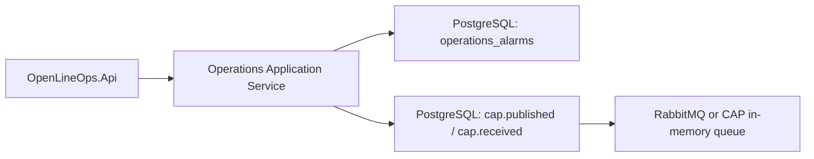

# Operations PostgreSQL Deployment

This guide describes the server deployment profile for the Operations bounded context
when alarms must be stored in PostgreSQL and integration events must be written through
the CAP outbox.

The local development defaults remain unchanged:

- Operations persistence defaults to the canonical `Sqlite` provider, backed by EF Core.
- EventBus defaults to in-memory CAP storage and in-memory message queue.
- EF Core/CAP transaction coordination is disabled unless explicitly enabled.

Use this profile for a server or production-like deployment, not for the default
single-workstation desktop profile.

## Runtime Shape



Operations uses EF Core through `OperationsDbContext`. CAP stores outbox records in
PostgreSQL when `OpenLineOps:EventBus:UseInMemory` is `false`.

If `OpenLineOps:EventBus:PublicationMode` is `Transactional`, OpenLineOps
uses CAP's EF Core transaction extension so the alarm row and CAP outbox row are
committed together. Enable this only when the Operations EF database and CAP
PostgreSQL storage point to the same PostgreSQL database.

## Configuration Keys

Operations persistence:

- `OpenLineOps:Operations:Persistence:Provider`: set exactly to `PostgreSql`.
  Provider tokens are case-sensitive; aliases are rejected during startup.
- `OpenLineOps:Operations:Persistence:ConnectionString`: PostgreSQL connection
  string for the Operations EF Core store.

EventBus:

- `ConnectionStrings:OpenLineOpsEventBus`: PostgreSQL connection string used by CAP.
- `OpenLineOps:EventBus:UseInMemory`: set to `false` for PostgreSQL CAP storage.
- `OpenLineOps:EventBus:ConnectionStringName`: defaults to `OpenLineOpsEventBus`.
- `OpenLineOps:EventBus:PostgreSqlSchema`: defaults to `cap`.
- `OpenLineOps:EventBus:PublicationMode`: explicitly set to `Transactional` only
  for a same-database EF/CAP transactional outbox; otherwise explicitly use `PostCommit`.
- `OpenLineOps:EventBus:RabbitMq:Enabled`: set to `true` for cross-process
  deployment messaging. Set to `false` for local PostgreSQL integration profiles
  that only need outbox persistence verification.

OpenLineOps fails fast when the publication mode is missing, when `UseInMemory=false`
and the named EventBus connection string is missing, or when `PublicationMode=Transactional`
is combined with in-memory EventBus storage.

## Production-Like JSON Profile

Keep secrets out of committed files. This JSON shows the required shape only.

```json
{
  "ConnectionStrings": {
    "OpenLineOpsEventBus": "Host=postgres;Database=openlineops;Username=openlineops;Password=..."
  },
  "OpenLineOps": {
    "Operations": {
      "Persistence": {
        "Provider": "PostgreSql",
        "ConnectionString": "Host=postgres;Database=openlineops;Username=openlineops;Password=..."
      }
    },
    "EventBus": {
      "UseInMemory": false,
      "ConnectionStringName": "OpenLineOpsEventBus",
      "PostgreSqlSchema": "cap",
      "PublicationMode": "Transactional",
      "RabbitMq": {
        "Enabled": true,
        "HostName": "rabbitmq",
        "UserName": "openlineops",
        "Password": "...",
        "VirtualHost": "/",
        "ExchangeName": "openlineops.events",
        "Port": 5672
      }
    }
  }
}
```

For the transactional profile, the two PostgreSQL connection strings should resolve
to the same database. They may be written as two separate configuration values, but
they must describe the same PostgreSQL database if the alarm row and CAP outbox row
are expected to commit atomically.

## Environment Variable Example

ASP.NET Core maps `__` to nested configuration keys.

PowerShell:

```powershell
$env:ConnectionStrings__OpenLineOpsEventBus = "Host=localhost;Database=openlineops;Username=openlineops;Password=openlineops"
$env:OpenLineOps__Operations__Persistence__Provider = "PostgreSql"
$env:OpenLineOps__Operations__Persistence__ConnectionString = "Host=localhost;Database=openlineops;Username=openlineops;Password=openlineops"
$env:OpenLineOps__EventBus__UseInMemory = "false"
$env:OpenLineOps__EventBus__ConnectionStringName = "OpenLineOpsEventBus"
$env:OpenLineOps__EventBus__PostgreSqlSchema = "cap"
$env:OpenLineOps__EventBus__PublicationMode = "Transactional"
$env:OpenLineOps__EventBus__RabbitMq__Enabled = "true"
$env:OpenLineOps__EventBus__RabbitMq__HostName = "localhost"
$env:OpenLineOps__EventBus__RabbitMq__UserName = "openlineops"
$env:OpenLineOps__EventBus__RabbitMq__Password = "openlineops"
```

Linux shell:

```bash
export ConnectionStrings__OpenLineOpsEventBus='Host=localhost;Database=openlineops;Username=openlineops;Password=openlineops'
export OpenLineOps__Operations__Persistence__Provider='PostgreSql'
export OpenLineOps__Operations__Persistence__ConnectionString='Host=localhost;Database=openlineops;Username=openlineops;Password=openlineops'
export OpenLineOps__EventBus__UseInMemory='false'
export OpenLineOps__EventBus__ConnectionStringName='OpenLineOpsEventBus'
export OpenLineOps__EventBus__PostgreSqlSchema='cap'
export OpenLineOps__EventBus__PublicationMode='Transactional'
export OpenLineOps__EventBus__RabbitMq__Enabled='true'
export OpenLineOps__EventBus__RabbitMq__HostName='localhost'
export OpenLineOps__EventBus__RabbitMq__UserName='openlineops'
export OpenLineOps__EventBus__RabbitMq__Password='openlineops'
```

## PostgreSQL Integration-Test Profile

For local integration tests that do not need RabbitMQ, keep CAP PostgreSQL storage
enabled and use CAP's in-memory message queue:

```json
{
  "ConnectionStrings": {
    "OpenLineOpsEventBus": "Host=localhost;Database=openlineops;Username=openlineops;Password=openlineops"
  },
  "OpenLineOps": {
    "Operations": {
      "Persistence": {
        "Provider": "PostgreSql",
        "ConnectionString": "Host=localhost;Database=openlineops;Username=openlineops;Password=openlineops"
      }
    },
    "EventBus": {
      "UseInMemory": false,
      "ConnectionStringName": "OpenLineOpsEventBus",
      "PostgreSqlSchema": "cap",
      "PublicationMode": "Transactional",
      "RabbitMq": {
        "Enabled": false
      }
    }
  }
}
```

This profile still verifies that CAP outbox rows are persisted in PostgreSQL. It does
not provide cross-process message delivery. Use RabbitMQ for multi-process deployment.

## Schema And Migrations

Operations uses EF Core migrations for both SQLite and PostgreSQL provider profiles.
`OperationsDbContext` applies pending migrations before repository writes and reads.

Expected PostgreSQL objects after first alarm write:

- `operations_alarms`
- EF Core migration history table
- CAP tables under the configured CAP schema, usually `cap.published` and
  `cap.received`

For production deployments, grant the API identity the privileges needed to create
or migrate those tables, or run migrations with a separate privileged deployment
identity before starting the application with a reduced runtime identity.

## Verification

Default verification, without Docker, discovers the optional PostgreSQL and RabbitMQ
container integration tests and skips them:

```powershell
dotnet test tests/OpenLineOps.PostgresIntegration.Tests/OpenLineOps.PostgresIntegration.Tests.csproj --no-build
```

Full PostgreSQL verification requires a working local Docker environment:

```powershell
$env:OPENLINEOPS_RUN_POSTGRES_INTEGRATION = "1"
dotnet test tests/OpenLineOps.PostgresIntegration.Tests/OpenLineOps.PostgresIntegration.Tests.csproj --no-build
```

RabbitMQ readiness verification also requires Docker, but it uses a separate opt-in
so broker reachability can be tested without running the PostgreSQL tests:

```powershell
$env:OPENLINEOPS_RUN_RABBITMQ_INTEGRATION = "1"
dotnet test tests/OpenLineOps.PostgresIntegration.Tests/OpenLineOps.PostgresIntegration.Tests.csproj --no-build
```

The Operations/CAP transactional test proves:

- `AddOpenLineOpsOperationsModule()` selects PostgreSQL persistence.
- `AddOpenLineOpsEventBus()` selects CAP PostgreSQL storage.
- `IIntegrationEventTransactionCoordinator` is registered.
- Raising an alarm writes `operations_alarms`.
- CAP writes at least one row to `cap.published`.

The RabbitMQ readiness test proves:

- `OpenLineOps:EventBus:RabbitMq` settings bind into the readiness probe path.
- A real RabbitMQ container accepts the configured host, port, username, password,
  and virtual host.
- The `openlineops.eventbus.rabbitmq` health check can open and close an AMQP
  connection successfully.

## Operational Rules

- Keep the default SQLite profile for local desktop development unless a station
  explicitly needs server persistence.
- Use the same PostgreSQL database for Operations and CAP when transaction
  coordination is enabled.
- Use `PublicationMode=PostCommit` for mixed providers, separate databases,
  SQLite-only desktop mode, or in-memory CAP mode.
- Enable RabbitMQ for cross-process event delivery.
- Keep PostgreSQL and RabbitMQ credentials in environment variables or a secret
  store, not in committed configuration files.
- Back up the PostgreSQL database before applying future Operations migrations.
- Treat CAP outbox growth as operational data: monitor failed messages, retention,
  and retry behavior through CAP configuration and deployment observability.

## Health Checks

OpenLineOps exposes:

- `/health/live`: process liveness.
- `/health/ready`: readiness for serving traffic.

The default local profile has no external readiness dependencies. When the server
profile selects PostgreSQL and RabbitMQ, `/health/ready` registers these dependency checks:

- `openlineops.operations.postgresql`: opens the Operations PostgreSQL connection
  and executes `SELECT 1`.
- `openlineops.eventbus.postgresql`: opens the CAP PostgreSQL connection selected
  by `OpenLineOps:EventBus:ConnectionStringName` and executes `SELECT 1`.
- `openlineops.eventbus.rabbitmq`: opens a RabbitMQ AMQP connection with the
  configured host, port, username, password, and virtual host, then closes it.

The checks are only registered when the corresponding provider is configured:

- Operations check: `OpenLineOps:Operations:Persistence:Provider` is exactly
  `PostgreSql`, and the Operations connection string is present. Readiness uses
  the same canonical provider parser as Operations module registration.
- EventBus check: `OpenLineOps:EventBus:UseInMemory` is `false`, the connection
  string name is present, and the named connection string exists.
- RabbitMQ check: `OpenLineOps:EventBus:UseInMemory` is `false` and
  `OpenLineOps:EventBus:RabbitMq:Enabled` is `true`.

The RabbitMQ check does not declare exchanges, queues, or bindings. It validates
transport reachability only. CAP remains responsible for runtime topology behavior.
